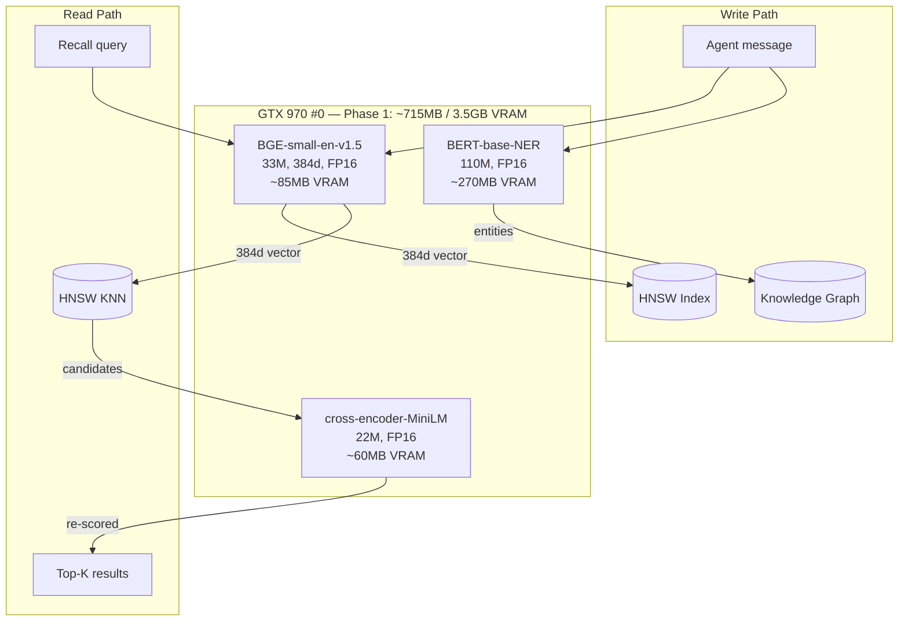

# Candle Inference Backend for Memory Intelligence

## Phase 1 Status: COMPLETE (CPU+MKL, not CUDA)

- Previous path: HTTP POST to Ollama at `100.64.0.7:7711` -- **887ms per call**
- Current path: Candle in-process on CPU+MKL -- **~5-15ms per call** (~100x improvement)
- No external service dependency -- embeddings work even if Ollama is down
- Pure Rust -- compiles into the binary, no Python, no `ort` version triangle

### CUDA blocked — root cause

`candle-kernels` 0.10.0 unconditionally compiles MoE WMMA kernels (`moe_wmma.cu`, `moe_wmma_gguf.cu`) that call `load_matrix_sync` / `store_matrix_sync` from CUDA's `mma.h`. These functions are only available on Tensor Core hardware (CC >= 7.0, Volta+). GTX 970 is CC 5.2. Setting `CUDA_COMPUTE_CAP=52` does not skip these files — the build.rs only uses compute cap to gate `NO_BF16_KERNEL`, not WMMA compilation.

**To re-enable CUDA when upstream patches:**

```toml
# In Cargo.toml workspace deps:
candle-core = { version = "0.10", features = ["cuda"] }
```

That is the entire change. All three driver files already have the `Device::Cpu` path and the `cuda_device` config field is preserved.

## Hardware: dedicated GTX 970

Four GPUs in this machine, allocated by workload:


| GPU         | VRAM             | Compute Cap | Role                                              |
| ----------- | ---------------- | ----------- | ------------------------------------------------- |
| GTX 970 #0  | 4GB (3.5GB fast) | 5.2         | **Memory intelligence (this plan)**               |
| GTX 1080 #1 | 8GB              | 6.1         | Ollama LLMs                                       |
| GTX 1080 #2 | 8GB              | 6.1         | Ollama LLMs / expansion                           |
| GTX 970 #3  | 4GB              | 5.2         | Voice inference (Kokoro + Whisper + LFM2.5-Audio) |


The memory GPU draws ~50W under inference load, ~15W idle. All models fit comfortably within the 3.5GB fast VRAM segment.

## The integration surface

The `EmbeddingDriver` trait in [embedding.rs](crates/openfang-runtime/src/embedding.rs) is 3 methods:

```rust
pub trait EmbeddingDriver: Send + Sync {
    async fn embed(&self, texts: &[&str]) -> Result<Vec<Vec<f32>>, EmbeddingError>;
    async fn embed_one(&self, text: &str) -> Result<Vec<f32>, EmbeddingError>;
    fn dimensions(&self) -> usize;
}
```

A `CandleEmbeddingDriver` implements this trait with zero HTTP, zero serialization. The kernel's `create_embedding_driver()` factory at line 178 gains a `"candle"` provider branch. Device selection is via `Device::new_cuda(config.memory.cuda_device)?`.

## Model stack: two phases

### Phase 1 -- standard BERT, CPU+MKL (384d, ~660MB RAM) -- IMPLEMENTED

All three are standard BERT variants that `candle-transformers::models::bert::BertModel` loads directly from safetensors. No ONNX, no custom architecture. All four memory intelligence functions now wired and functional. VRAM column reflects the target state when CUDA is re-enabled.




| Model                                  | Params   | VRAM (FP16) | Task              | Candle path                           |
| -------------------------------------- | -------- | ----------- | ----------------- | ------------------------------------- |
| `BAAI/bge-small-en-v1.5`               | 33M      | ~85MB       | Embeddings (384d) | candle-transformers BertModel         |
| `dslim/bert-base-NER`                  | 110M     | ~270MB      | Entity extraction | BertModel + token classification head |
| `cross-encoder/ms-marco-MiniLM-L-6-v2` | 22M      | ~60MB       | Reranking         | BertModel + sequence classification   |
| CUDA context                           | --       | ~300MB      | --                | --                                    |
| **Total**                              | **165M** | **~715MB**  |                   | **2.8GB headroom**                    |


### Phase 2 -- upgraded stack with Liquid + nomic (768d, ~1.7GB VRAM)

Swaps in higher-quality models via `candle-onnx` and adds session compaction. Requires HNSW dimension change from 384 to 768 (the DDL already handles this on boot via REMOVE INDEX + DEFINE INDEX).


| Model                                  | Params   | VRAM (FP16/Q) | Task                     | Candle path                         |
| -------------------------------------- | -------- | ------------- | ------------------------ | ----------------------------------- |
| `nomic-ai/nomic-embed-text-v1`         | 137M     | ~275MB FP16   | Embeddings (768d)        | candle-transformers JinaBert (RoPE) |
| `LiquidAI/LFM2-350M-Extract`           | 350M     | ~350MB Q8     | Entity extraction (JSON) | candle-onnx                         |
| `cross-encoder/ms-marco-MiniLM-L-6-v2` | 22M      | ~60MB FP16    | Reranking                | candle-transformers BertModel       |
| `LiquidAI/LFM2-2.6B-Transcript`        | 2.6B     | ~750MB Q4     | Session compaction       | candle-onnx                         |
| CUDA context                           | --       | ~300MB        | --                       | --                                  |
| **Total**                              | **3.1B** | **~1.7GB**    |                          | **1.8GB headroom**                  |


## Implementation phases

### Phase 1a: Dependencies and model cache

**New dependencies** in workspace [Cargo.toml](Cargo.toml):

```toml
candle-core = { version = "0.8", features = ["cuda"] }
candle-nn = { version = "0.8" }
candle-transformers = { version = "0.8" }
candle-onnx = { version = "0.8" }
tokenizers = { version = "0.21", default-features = false, features = ["onig"] }
hf-hub = { version = "0.4", features = ["tokio"] }
```

**New file**: `crates/openfang-runtime/src/model_cache.rs` (~100 lines)

- Download models from HF Hub on first use to `~/.openfang/models/{model_id}/`
- Check for existing safetensors + tokenizer.json + config.json
- `hf-hub` crate handles auth, caching, and bandwidth

### Phase 1b: CandleEmbeddingDriver (replaces Ollama for embeddings)

**New file**: `crates/openfang-runtime/src/candle_embedding.rs` (~200 lines)

- `CandleEmbeddingDriver` struct: holds `BertModel`, `Tokenizer`, `Device`
- `load(model_id, cuda_device)` constructor: resolves model from cache (or triggers download), builds tokenizer, loads safetensors via `VarBuilder` onto `Device::new_cuda(cuda_device)`
- `impl EmbeddingDriver`: tokenize input, run `model.forward()`, mean-pool with attention mask, L2-normalize, return `Vec<f32>`
- All inference runs on `tokio::task::spawn_blocking` to avoid starving the async runtime

**Modify**: [embedding.rs](crates/openfang-runtime/src/embedding.rs) line 178

- Add `"candle"` branch in `create_embedding_driver()` that calls `CandleEmbeddingDriver::load()`

**Modify**: [config.rs](crates/openfang-types/src/config.rs) `MemoryConfig`

- Add `cuda_device: Option<u32>` field (default: `None` = CPU, `Some(0)` = first GPU)

**Modify**: [db.rs](crates/openfang-memory/src/db.rs)

- Revert HNSW dimension from 768 to 384 (BGE-small is 384d)

**Config**: `~/.openfang/config.toml`

```toml
[memory]
embedding_provider = "candle"
embedding_model = "BAAI/bge-small-en-v1.5"
cuda_device = 0
```

**Test**: Unit test embedding "hello world", assert 384 dimensions. Benchmark vs Ollama latency.

### Phase 1c: NER-based knowledge graph population

**New file**: `crates/openfang-runtime/src/candle_ner.rs` (~250 lines)

- `CandleNerDriver` struct: holds `BertModel` with token classification head, `Tokenizer`, `Device`
- `extract_entities(text) -> Vec<(String, EntityType, f32)>` -- runs BERT-NER on CUDA, decodes BIO tags to entity spans
- Entity types map to existing `EntityType` enum: Person, Organization, Location, etc.

**Modify**: [semantic.rs](crates/openfang-memory/src/semantic.rs) `remember_with_embedding()`

- After creating the memory record, call `ner_driver.extract_entities(&content)`
- For each entity: `knowledge.add_entity(entity)` + `knowledge.add_relation(agent_memory_link)`
- This is the write-path entity extraction that populates the currently-empty knowledge graph

**Modify**: [substrate.rs](crates/openfang-memory/src/substrate.rs)

- `MemorySubstrate` gains an `Option<Arc<CandleNerDriver>>` field
- Passed through from the kernel at boot

### Phase 1d: Cross-encoder reranking

**New file**: `crates/openfang-runtime/src/candle_reranker.rs` (~150 lines)

- `CandleReranker` struct: cross-encoder BERT with classification head on CUDA
- `rerank(query: &str, candidates: &[MemoryFragment]) -> Vec<MemoryFragment>` -- scores each (query, candidate.content) pair, re-sorts by score
- Loaded from `cross-encoder/ms-marco-MiniLM-L-6-v2` safetensors

**Modify**: [semantic.rs](crates/openfang-memory/src/semantic.rs) `recall_vector()`

- After HNSW KNN returns candidates, pass through reranker before returning
- Reranking is optional (only when reranker is loaded)

### Phase 2: Upgrade to Liquid + nomic models

- Swap `BGE-small` to `nomic-embed-text-v1` (768d) via candle-transformers JinaBert
- Swap `BERT-base-NER` to `LFM2-350M-Extract` (ONNX) via candle-onnx
- Add `LFM2-2.6B-Transcript` (ONNX Q4) for session compaction during consolidation
- Update HNSW dimension from 384 to 768 (DDL handles migration on boot)
- Cross-encoder stays (it's already optimal at 22M params)

## What this unlocks

After Phase 1, the memory layer has all three active read paths plus write-path intelligence:

1. **Sessions** -- recent conversation history (already working)
2. **Semantic** -- HNSW KNN + BM25 hybrid search with cross-encoder reranking
3. **Knowledge graph** -- auto-populated from NER extraction on every `remember()`, queryable via `traverse_from()`

After Phase 2, session compaction joins the consolidation engine for long-running agents, and retrieval quality improves across the board from the model upgrades.

## What stays the same

- `EmbeddingDriver` trait interface -- unchanged
- `kernel.send_message_streaming()` -- unchanged
- SurrealDB schema, HNSW/BM25 indexes -- dimension changes handled by DDL on boot
- The Ollama HTTP driver (`OpenAIEmbeddingDriver`) remains as a fallback provider
- Config: `embedding_provider = "ollama"` still works, `"candle"` is the new option

## GPU allocation context (cross-plan)

This plan covers GTX 970 #0 only. The full machine allocation:

- **GTX 970 #0**: Memory intelligence (this plan) -- Candle, ~1.7GB target
- **GTX 970 #3**: Voice inference (separate plan) -- ONNX Runtime, Kokoro 82M + Distil-Whisper 756M + LFM2.5-Audio 1.5B, ~1.9-2.6GB
- **GTX 1080 #1/#2**: Ollama LLMs -- 8GB each, available for large model serving

