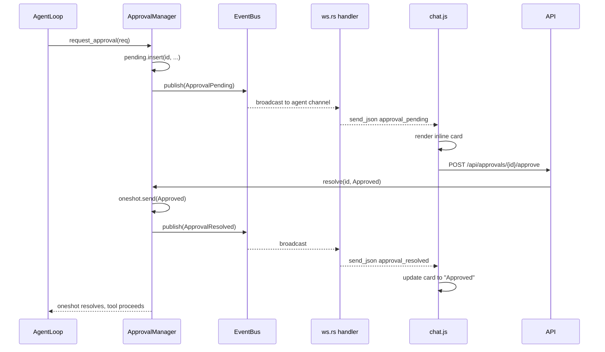

# Inline Approval Cards

Push approval requests into the agent WebSocket chat stream so users can approve/deny without leaving the conversation.

## Data flow




---

## Step 1 -- Add EventPayload variant for approvals

**File:** [crates/openfang-types/src/event.rs](crates/openfang-types/src/event.rs)

Add a new variant to `EventPayload` (line ~72):

```rust
/// Approval lifecycle events (pending, resolved, expired).
Approval(ApprovalEvent),
```

Define `ApprovalEvent` enum in the same file (or re-export from `approval.rs`):

```rust
#[derive(Debug, Clone, Serialize, Deserialize)]
pub enum ApprovalEvent {
    Pending {
        id: Uuid,
        agent_id: String,
        tool_name: String,
        action_summary: String,
        risk_level: RiskLevel,
        timeout_secs: u64,
    },
    Resolved {
        id: Uuid,
        agent_id: String,
        decision: ApprovalDecision,
    },
    Expired {
        id: Uuid,
        agent_id: String,
    },
}
```

Use field names matching `ApprovalRequest` (`action_summary`, not `args_summary`; `risk_level` from the existing enum).

---

## Step 2 -- Publish events from ApprovalManager

**File:** [crates/openfang-kernel/src/approval.rs](crates/openfang-kernel/src/approval.rs)

The manager currently has no reference to `EventBus`. Add one:

- Add `event_bus: Arc<EventBus>` field to `ApprovalManager` (line 18).
- Update `ApprovalManager::new()` to accept `event_bus: Arc<EventBus>`.
- Update the call site in [kernel.rs](crates/openfang-kernel/src/kernel.rs) line 945 to pass `Arc::clone(&event_bus)`.

Publish at three points:

1. **After `pending.insert`** (line ~76) -- publish `ApprovalEvent::Pending { ... }` targeted to `EventTarget::Agent(agent_id)`.
2. **In `resolve()`** after `pending.sender.send(decision)` (line ~120) -- publish `ApprovalEvent::Resolved { ... }`.
3. **In the timeout branch** after `pending.remove` (line ~88) -- publish `ApprovalEvent::Expired { ... }`.

Use `event_bus.publish()` (async); wrap in `tokio::spawn` if needed since `resolve()` is sync today. Alternatively, keep a `tokio::sync::mpsc` internally and spawn a drain task -- but the simplest approach is to make `resolve` accept a handle or use `tokio::task::block_in_place` since it's called from async API handlers anyway.

Cleanest approach: add `pub async fn resolve_async(...)` that does the same work + publish, and have the sync `resolve()` call it via a spawned task. Or just make `resolve` async (callers in `routes.rs` are already async).

---

## Step 3 -- Subscribe in the WebSocket handler

**File:** [crates/openfang-api/src/ws.rs](crates/openfang-api/src/ws.rs)

In `handle_agent_ws` (line 217), alongside the existing `agents_updated` background task (lines 245-292), spawn a second task:

```rust
// Approval event forwarder
let sender_approvals = Arc::clone(&sender);
let mut approval_rx = state.kernel.event_bus.subscribe_agent(agent_id);
let approval_handle = tokio::spawn(async move {
    loop {
        match approval_rx.recv().await {
            Ok(event) => {
                if let EventPayload::Approval(ref ae) = event.payload {
                    let json = match ae {
                        ApprovalEvent::Pending { id, tool_name, action_summary, timeout_secs, risk_level, .. } => {
                            serde_json::json!({
                                "type": "approval_pending",
                                "id": id.to_string(),
                                "tool": tool_name,
                                "action_summary": action_summary,
                                "risk_level": format!("{:?}", risk_level),
                                "timeout_secs": timeout_secs,
                            })
                        }
                        ApprovalEvent::Resolved { id, decision, .. } => {
                            serde_json::json!({
                                "type": "approval_resolved",
                                "id": id.to_string(),
                                "decision": format!("{:?}", decision),
                            })
                        }
                        ApprovalEvent::Expired { id, .. } => {
                            serde_json::json!({
                                "type": "approval_expired",
                                "id": id.to_string(),
                            })
                        }
                    };
                    if send_json(&sender_approvals, &json).await.is_err() {
                        break;
                    }
                }
            }
            Err(broadcast::error::RecvError::Lagged(_)) => continue,
            Err(_) => break,
        }
    }
});
```

Abort this handle in cleanup (line ~382) alongside `update_handle.abort()`.

This follows the exact same `Arc::clone(&sender)` + `tokio::spawn` + `send_json` + break-on-error pattern as the existing `agents_updated` task.

---

## Step 4 -- Frontend: handle new WS types in chat.js

**File:** [crates/openfang-api/static/js/pages/chat.js](crates/openfang-api/static/js/pages/chat.js)

Add three new cases in the `handleWsMessage` switch (after the existing `canvas` case, line ~895):

### `approval_pending`

- Push a new message into `this.messages` with `role: 'system'` and a new flag `approval: { id, tool, action_summary, timeout_secs, risk_level, status: 'pending', expiresAt: Date.now() + timeout_secs * 1000 }`.
- Start a per-card `setInterval` (1s) that updates a countdown display; on reaching 0, mark `status: 'expired'` (server will also send `approval_expired` as confirmation).
- `scrollToBottom()`.

### `approval_resolved`

- Find the message where `msg.approval && msg.approval.id === data.id`.
- Set `msg.approval.status = data.decision.toLowerCase()` (approved / denied).
- Clear the countdown interval.

### `approval_expired`

- Same lookup; set `msg.approval.status = 'expired'`; clear interval.

Add two action methods to the `chatPage` component:

```javascript
async approveInline(approvalId) {
    try {
        await OpenFangAPI.post('/api/approvals/' + approvalId + '/approve', {});
    } catch(e) {
        OpenFangToast.error('Approve failed: ' + e.message);
    }
},
async rejectInline(approvalId) {
    try {
        await OpenFangAPI.post('/api/approvals/' + approvalId + '/reject', {});
    } catch(e) {
        OpenFangToast.error('Reject failed: ' + e.message);
    }
},
```

These call the **existing** REST endpoints -- resolution flows back through the kernel to the WS as `approval_resolved`.

---

## Step 5 -- Frontend: render inline approval card in HTML

**File:** [crates/openfang-api/static/index_body.html](crates/openfang-api/static/index_body.html)

Inside the message `x-for` loop (after the tool-cards template block ending at line ~691, before the timestamp row at line ~693), add:

```html
<template x-if="msg.approval">
  <div class="approval-card" :class="'approval-' + msg.approval.status">
    <div class="approval-card-header">
      <span class="approval-icon">⚠</span>
      <span class="approval-title">Tool Approval Required</span>
      <span class="approval-risk" x-text="msg.approval.risk_level"></span>
    </div>
    <div class="approval-card-detail">
      <span class="approval-label">Tool:</span>
      <span x-text="msg.approval.tool"></span>
    </div>
    <div class="approval-card-detail" x-show="msg.approval.action_summary">
      <span class="approval-label">Action:</span>
      <span x-text="msg.approval.action_summary"></span>
    </div>
    <div class="approval-card-actions" x-show="msg.approval.status === 'pending'">
      <button class="approval-btn approval-btn-allow" @click="approveInline(msg.approval.id)">Allow</button>
      <button class="approval-btn approval-btn-deny" @click="rejectInline(msg.approval.id)">Deny</button>
      <span class="approval-countdown" x-text="msg.approval._countdown || ''"></span>
    </div>
    <div class="approval-card-resolved" x-show="msg.approval.status !== 'pending'">
      <span x-text="msg.approval.status === 'approved' ? 'Approved' : msg.approval.status === 'denied' ? 'Denied' : 'Expired'"></span>
    </div>
  </div>
</template>
```

---

## Step 6 -- CSS for approval cards

**File:** [crates/openfang-api/static/css/components.css](crates/openfang-api/static/css/components.css)

Add after the `.tool-card` block (line ~705). Follow the same design tokens (`--surface`, `--border`, `--radius-md`, `--shadow-xs`, `--accent`, `--error`) used by tool cards:

- `.approval-card` -- same structure as `.tool-card` but with `border-left: 3px solid #FBBF24` (warning amber, matching shell tool color).
- `.approval-pending` -- subtle pulsing background animation (reuse the existing `pulse` keyframe from line 374).
- `.approval-approved` -- green left border + muted background.
- `.approval-denied`, `.approval-expired` -- red/gray left border + muted background.
- `.approval-btn-allow` / `.approval-btn-deny` -- compact action buttons.
- `.approval-countdown` -- small dim text, right-aligned.

---

## Step 7 -- Build, deploy, verify

1. `cargo build --release --bin openfang` (the static files are `include_str!` embedded).
2. Deploy binary, restart daemon.
3. Verify: trigger a tool that requires approval (e.g. `shell_exec` with default policy), confirm the card appears inline in the chat WebSocket, click Allow/Deny, confirm the agent resumes.

---

## Files touched (summary)


| File                                            | Change                                                      |
| ----------------------------------------------- | ----------------------------------------------------------- |
| `crates/openfang-types/src/event.rs`            | Add `ApprovalEvent` enum + `EventPayload::Approval` variant |
| `crates/openfang-kernel/src/approval.rs`        | Add `event_bus` field; publish on insert, resolve, timeout  |
| `crates/openfang-kernel/src/kernel.rs`          | Pass `event_bus` to `ApprovalManager::new()`                |
| `crates/openfang-api/src/ws.rs`                 | Spawn approval event subscriber task                        |
| `crates/openfang-api/static/js/pages/chat.js`   | Handle 3 new WS types + approve/reject methods + countdown  |
| `crates/openfang-api/static/index_body.html`    | Approval card template in message loop                      |
| `crates/openfang-api/static/css/components.css` | Approval card styles                                        |


## Not in scope (defer)

- SurrealDB-backed approval audit history
- `on_timeout = "pause"` kernel semantics
- Dedicated `/ws/approvals` global subscription
- Multi-daemon horizontal scale

