# Memory Architecture Upgrade

## Current State (the gap)

The SurrealDB schema in [db.rs](crates/openfang-memory/src/db.rs) defines HNSW (384d, cosine) and BM25 indexes, but **nothing in the query layer uses them**:

- [semantic.rs](crates/openfang-memory/src/semantic.rs) over-fetches 10x records into Rust, then brute-force cosine-sorts (line 200-222)
- Text search uses `CONTAINS` (substring match) instead of BM25 `@1@` (line 127)
- Record IDs are generated fresh instead of extracted from SurrealDB (line 184, marked TODO)
- [knowledge.rs](crates/openfang-memory/src/knowledge.rs) queries the relations table with flat SQL instead of graph traversal `->` operators (line 144-157)
- [substrate.rs](crates/openfang-memory/src/substrate.rs) `consolidate()` is a no-op returning zeros (line 595-604)
- `export()` and `import()` are stubs (lines 606-618)

Additionally: `all-MiniLM-L6-v2` is configured but **NOT pulled** in Ollama. Available embedding model: `nomic-embed-text` (768d). The HNSW index must be aligned.

## Architecture (target state)

```mermaid
flowchart TB
    subgraph writeP [Write Path]
        AgentLoop[Agent Loop] -->|"remember()"| EmbedDriver[Embedding Driver]
        EmbedDriver -->|"embed_one(text)"| OllamaAPI["Ollama API\n(nomic-embed-text, 768d)"]
        OllamaAPI --> SemanticStore[SemanticStore]
        SemanticStore -->|"CREATE memories"| SurrealDB[(SurrealDB)]
        SurrealDB -->|"auto-index"| HNSW[HNSW Index]
        SurrealDB -->|"auto-index"| BM25[BM25 Index]
    end

    subgraph readP [Read Path]
        Recall["recall_with_embedding()"] -->|"HNSW KNN"| SurrealDB2[(SurrealDB)]
        Recall -->|"BM25 @@"| SurrealDB2
        SurrealDB2 --> Hybrid["Hybrid Merge\n(0.6 vector + 0.4 text)"]
        Hybrid --> Fragments[MemoryFragments]
    end

    subgraph graphP [Knowledge Graph]
        QueryGraph["query_graph()"] -->|"-> traversal"| SurrealDB3[(SurrealDB)]
        SurrealDB3 -->|"multi-hop"| GraphMatch[GraphMatch results]
    end

    subgraph consolidateP [Consolidation]
        Cron[Consolidation Timer] -->|"iterate agents"| DecayScore["Score by age + access"]
        DecayScore -->|"UPDATE SET confidence"| SurrealDB4[(SurrealDB)]
        DecayScore -->|"DELETE WHERE confidence < threshold"| SurrealDB4
    end
```




## Phase 1: Wire existing SurrealDB capabilities

### 1a. Align embedding model with Ollama availability

The HNSW index dimension must match the embedding model. Two options:

- **Option A (quick):** Pull `all-minilm` into Ollama (`ollama pull all-minilm`). Keeps 384d HNSW index unchanged.
- **Option B (better quality):** Switch to `nomic-embed-text` (768d, already pulled, longer context, better retrieval quality). Requires changing HNSW index dimension in `db.rs` from 384 to 768, and updating `~/.openfang/config.toml`.

**Recommendation: Option B** -- `nomic-embed-text` is a significantly better embedding model (8192 token context vs 256 for MiniLM). Since existing memory data was likely embedded with wrong dimensions anyway (the OpenAI auto-detect bug from earlier), this is a clean break.

Changes:

- `db.rs:58-59` -- change `HNSW DIMENSION 384` to `HNSW DIMENSION 768`
- `~/.openfang/config.toml` -- `embedding_model = "nomic-embed-text"`, `embedding_provider = "ollama"`
- Comment in `db.rs` updated to document the dimension-model coupling

### 1b. Replace brute-force cosine with native HNSW KNN

Rewrite `SemanticStore::recall_with_embedding` in [semantic.rs](crates/openfang-memory/src/semantic.rs):

**Vector path** (embedding provided): Use HNSW KNN operator `<|k,ef|>`:

```sql
SELECT *, vector::distance::knn() AS distance
FROM memories
WHERE embedding <|$limit, 40|> $query_embedding
  AND deleted = false
  AND agent_id = $filter_aid
ORDER BY distance
LIMIT $limit
```

**Text-only path** (no embedding): Use BM25 `@1@` instead of `CONTAINS`:

```sql
SELECT *, search::score(1) AS relevance
FROM memories
WHERE content @1@ $query_text
  AND deleted = false
  AND agent_id = $filter_aid
ORDER BY relevance DESC
LIMIT $limit
```

**Hybrid path** (both embedding and text available): Two-query merge with weighted scoring:

```sql
-- Vector candidates
SELECT *, vector::similarity::cosine(embedding, $emb) AS vs, 0 AS ts
FROM memories WHERE embedding <|20, 40|> $emb AND deleted = false AND agent_id = $aid;

-- Text candidates
SELECT *, 0 AS vs, search::score(1) AS ts
FROM memories WHERE content @1@ $query AND deleted = false AND agent_id = $aid;
```

Merge in Rust with `(vs * 0.6 + ts * 0.4)`, dedup by record ID, sort, truncate.

### 1c. Fix record ID extraction bug

Line 184 of `semantic.rs` generates a fresh `MemoryId::new()` instead of extracting the SurrealDB record ID. This breaks `forget()` and access-count updates.

Fix: Add `id` to the query's SELECT output, deserialize the SurrealDB `Thing` record ID, extract the key portion, and parse it back to `MemoryId(Uuid)`.

### 1d. Wire consolidation engine

Replace the no-op in `substrate.rs:595-604` with actual logic:

1. `SELECT DISTINCT agent_id FROM memories WHERE deleted = false` -- get all agents
2. For each agent: `UPDATE memories SET confidence = confidence * (1.0 - $decay_rate) WHERE agent_id = $aid AND confidence > 0.1`
3. Prune: `UPDATE memories SET deleted = true WHERE agent_id = $aid AND confidence < $threshold`
4. Count affected rows, return real `ConsolidationReport`

### 1e. Multi-hop graph traversal

Add a `query_graph_traversal` method to [knowledge.rs](crates/openfang-memory/src/knowledge.rs) using SurrealDB's native `->` operator:

```sql
-- 2-hop traversal from a source entity
SELECT ->relations->entities AS hop1,
       ->relations->entities->relations->entities AS hop2
FROM type::thing('entities', $source_id)
```

Parameterize `max_depth` (1, 2, or 3 hops). Keep the existing flat `query_graph` as a compatibility method.

### 1f. Add secondary indexes to DDL

In `db.rs`, add missing indexes that speed up common queries:

```sql
DEFINE INDEX IF NOT EXISTS idx_memories_agent ON memories FIELDS agent_id;
DEFINE INDEX IF NOT EXISTS idx_sessions_agent ON sessions FIELDS agent_id;
DEFINE INDEX IF NOT EXISTS idx_usage_agent ON usage FIELDS agent_id;
DEFINE INDEX IF NOT EXISTS idx_usage_created ON usage FIELDS created_at;
```

## Phase 2: Enable SurrealML

Add the `ml` feature to the workspace `surrealdb` dependency in the root [Cargo.toml](Cargo.toml):

```toml
surrealdb = { version = "2", features = ["kv-surrealkv", "kv-mem", "ml"], default-features = false }
```

This pulls in `surrealml-core` 0.1.1 (ONNX Runtime). Once compiled, `ml::` functions become available in SurrealQL. This phase is **compile-and-verify only** -- no application code changes beyond the feature flag. The compilation may surface dependency issues that need resolution.

## Phase 3: Liquid LFM2 model family (documented, not implemented this session)

From [models.md](docs/research/models.md), the target architecture uses Liquid's model family as the baked-in inference tier:

- **LFM2-ColBERT-350M** (128d late-interaction) replaces single-vector dense embeddings for higher-quality retrieval
- **LFM2-350M-Extract** for entity extraction (auto-populates knowledge graph)
- **LFM2-1.2B-RAG** for context-grounded Q&A (local retrieval-augmented reasoning)
- **LFM2.5-1.2B-Thinking** (already pulled in Ollama) for small-model fallback

Implementation path: Liquid's Candle fork as unified inference backend, models exported to `.surml` for SurrealML in-query operations (reranking, consolidation scoring, auto-tagging via `DEFINE EVENT`).

This requires a new crate (`openfang-inference` or similar) and is a multi-session effort.