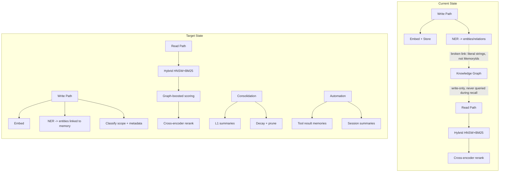
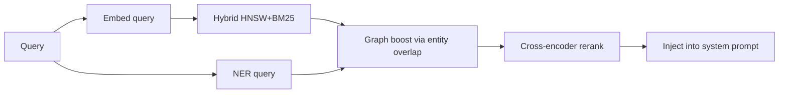
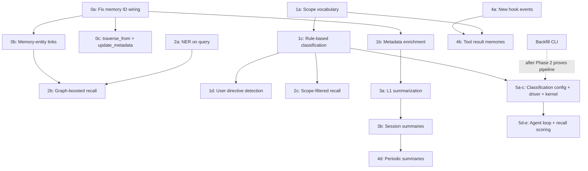

# Memory Intelligence Completion Plan

## Verified Reality Checks

All six reality checks from the architect review have been verified against the codebase:

- **RC-1 (MemoryId propagation)**: Confirmed. `remember_with_embedding_async` return value is discarded via `let _ =`. Graph population uses literal strings `"response"` / `"streaming-response"`.
- **RC-2 (Knowledge graph link integrity)**: Confirmed. No valid memory-to-entity linkage exists. Relations resolve to non-existent entity IDs.
- **RC-3 (Metadata mutability)**: Confirmed mutable. `UPDATE memories SET ...` is already used by the consolidation engine. `memories` is SCHEMALESS with `metadata FLEXIBLE TYPE object`. Requires a new `SemanticStore::update_metadata` method.
- **RC-4 (NER at recall time)**: Requires plumbing. NER driver lives on `Kernel`, not passed to agent loop. Same pattern as reranker wiring -- pass `Option<&CandleNerDriver>` as a new parameter. No threading/async blockers.
- **RC-5 (Consolidation execution context)**: Confirmed. Runs in kernel's `tokio::spawn` + `tokio::time::interval` loop in `start_background_agents`. Kernel has direct LLM/embedding driver access.
- **RC-6 (Hook system capability)**: Confirmed trivial. `HookEvent` is a simple enum; `HookRegistry` is `DashMap`. Adding variants is a one-line change + `fire()` call.

## Current State

OpenFang's memory system has strong foundations but several components are either disconnected or unused:

- **Embeddings, NER, Reranker**: all wired and running on CPU (from last session)
- **Hybrid search** (HNSW + BM25): implemented in [semantic.rs](crates/openfang-memory/src/semantic.rs)
- **Knowledge graph**: entities and relations stored, but **never read during recall**
- **Consolidation**: decay + prune only, no summarization
- **Scope**: always `"episodic"`, never filtered on
- **Metadata**: always `HashMap::new()`, never populated
- **Classification**: does not exist
- `**populate_knowledge_graph`**: passes literal strings as memory_id -- relations don't link back to real memory records



---

## Phase 0 -- Fix Broken Knowledge Graph Wiring

**Goal**: Make `populate_knowledge_graph` produce valid, queryable graph data linked to real memory records.

**Acceptance criteria**: No literal string IDs remain in `populate_knowledge_graph` call sites. Graph traversal from an entity returns memories linked to it. `update_metadata` method exists and is tested.

### 0a. Pass actual MemoryId to populate_knowledge_graph

Currently, the two call sites in [kernel.rs](crates/openfang-kernel/src/kernel.rs) (lines 2276 and 2847) pass hardcoded strings. The `remember_with_embedding_async` call in [agent_loop.rs](crates/openfang-runtime/src/agent_loop.rs) returns a `MemoryId` that is discarded.

- Capture the `MemoryId` returned from `remember_with_embedding_async` in `agent_loop.rs`
- Return it from the agent loop result (add to `AgentLoopResult` or return alongside it)
- In `kernel.rs`, pass that actual ID string to `populate_knowledge_graph`

Observability: log the `MemoryId` alongside NER results in `populate_knowledge_graph` via `tracing::debug!`.

### 0b. Create memory-to-entity edges

`populate_knowledge_graph` currently creates `entities -> RelatedTo -> entities` edges. The source should be the memory record, not another entity.

Two options (recommend option 1 for simplicity):

1. **Store entity IDs in memory metadata**: After NER, update the memory record's `metadata` with `{"entities": ["entity-id-1", "entity-id-2"]}`. This requires a new `SemanticStore::update_metadata` method.
2. **SurrealDB RELATE edge**: `RELATE memories:id -> mentions -> entities:id`. More graph-native but requires new DDL and a new edge table.

### 0c. Expose traverse_from on the Memory trait and add update_metadata

- `KnowledgeStore::traverse_from` exists but is not on the `Memory` trait. Add it so the recall path (and tools) can use multi-hop traversal.
- Add `SemanticStore::update_metadata(memory_id, metadata)` -- needed for post-write enrichment (NER entity backfill, classification results). The `memories` table supports `UPDATE` (already used by consolidation for `confidence` and `deleted`).

**Files**: [kernel.rs](crates/openfang-kernel/src/kernel.rs), [agent_loop.rs](crates/openfang-runtime/src/agent_loop.rs), [memory.rs](crates/openfang-types/src/memory.rs), [substrate.rs](crates/openfang-memory/src/substrate.rs), [knowledge.rs](crates/openfang-memory/src/knowledge.rs), [semantic.rs](crates/openfang-memory/src/semantic.rs)

---

## Phase 1 -- Enrich the Write Path (Scope, Metadata, Classification)

**Goal**: Every memory written carries meaningful scope, metadata, and classification signals.

**Acceptance criteria**: 100% of new memories written after this phase contain a non-empty scope (not just `"episodic"` for everything) and at least `session_id` + `source_role` in metadata. Directive detection produces `declarative` memories for explicit user instructions.

### 1a. Define scope vocabulary

Replace the hardcoded `"episodic"` with a proper enum or documented vocabulary:

- `episodic` -- conversation turns (current default)
- `semantic` -- distilled knowledge / L1 summaries (Phase 3)
- `procedural` -- how-to / process knowledge
- `declarative` -- facts, preferences, user-stated information

Classification of scope can start rule-based:

- If source is `UserProvided` -> `declarative`
- If source is `Observation` (tool output) -> `procedural`
- If source is `Conversation` -> `episodic`
- Summaries from consolidation -> `semantic`

### 1b. Populate metadata at write time

Enrich `HashMap::new()` in [agent_loop.rs](crates/openfang-runtime/src/agent_loop.rs) (six call sites) with:

- `session_id`: current session UUID
- `turn_index`: message position in session
- `source_role`: `"user"` vs `"assistant"` vs `"tool"`
- `token_count`: rough token estimate of content
- `entities`: (from Phase 0b, if NER is synchronous; otherwise backfilled)

Observability: log scope, source_role, and metadata key count on each write via `tracing::debug!`.

### 1c. Lightweight classification at ingestion

Before committing to a dedicated ML model, use a rule-based classifier that runs in the `agent_loop.rs` write path:

- Derive `scope` from `MemorySource` + content heuristics (questions vs statements vs instructions)
- Set `metadata.priority` based on content signals (user directives like "remember this" get high priority; routine conversation gets normal)
- Set `metadata.category` with broad buckets: `fact`, `preference`, `instruction`, `observation`, `question`

This is pure Rust, no new inference, and immediately enables filtered recall.

### 1d. User directive detection (early win)

Detect explicit user memory directives ("remember that...", "note that...", "my preference is...") in the agent loop:

- Simple keyword/pattern matching on the user message
- Store with `source = UserProvided`, `scope = "declarative"`, `metadata.priority = "high"`
- This validates the declarative scope path before building heavier machinery

**Files**: [agent_loop.rs](crates/openfang-runtime/src/agent_loop.rs), [memory.rs](crates/openfang-types/src/memory.rs)

---

## Phase 2 -- Graph-Boosted Recall

**Goal**: The knowledge graph actively influences what the agent remembers during recall.

**Acceptance criteria**: Graph boost measurably changes top-k recall ordering in cases where query entities overlap with stored entities. Entity overlap score is logged per recall. NER driver is available at recall time without architectural hacks.

### 2a. NER on the query

At recall time, run NER on the user's incoming message (not just the response). This extracts entities the user is asking about.

- Plumb the NER driver into the agent loop as `Option<&CandleNerDriver>` (same pattern as reranker wiring from [kernel.rs](crates/openfang-kernel/src/kernel.rs) lines 2182-2199)
- In `agent_loop.rs`, if the NER driver is available, run `ner.extract_entities(user_message)` before or in parallel with embedding
- Collect the entity names/types

### 2b. Entity-aware recall boosting

After hybrid search returns candidates:

1. For each candidate memory, check its `metadata.entities` (from Phase 0b) for overlap with query entities
2. Boost scores for memories that share entities with the query
3. Optionally, use `traverse_from` to find memories 1-2 hops away from query entities in the graph

This sits between hybrid search and reranking in the pipeline:



Observability: log per recall -- retrieval path used (vector/hybrid/text/recent), graph contribution score, rerank delta, scope distribution of returned results.

### 2c. Scope-filtered recall

Update the `MemoryFilter` construction in `agent_loop.rs` to use scope strategically:

- Default recall: all scopes (current behavior, no regression)
- Optionally weight `semantic` scope memories higher (they are summaries, more information-dense)
- For factual queries (detected via NER or classification), prefer `declarative` scope

**Files**: [agent_loop.rs](crates/openfang-runtime/src/agent_loop.rs), [semantic.rs](crates/openfang-memory/src/semantic.rs), [knowledge.rs](crates/openfang-memory/src/knowledge.rs), [kernel.rs](crates/openfang-kernel/src/kernel.rs)

---

## Phase 3 -- Tiered Memory and Consolidation Summarization

**Goal**: Memories compress over time from full-detail (L0) to summaries (L1) to distilled knowledge (L2).

**Acceptance criteria**: L1 summaries exist with `scope = "semantic"` and traceable `metadata.summarized_from`. Summaries reduce token footprint compared to raw episodic memories. Original memories are never hard-deleted by summarization (only accelerated decay via lower confidence).

### Summary safety invariants

- Summaries MUST always carry `metadata.summarized_from = [memory_ids]`
- Original memories are NEVER hard-deleted by the summarization process -- only confidence-reduced for natural decay
- Re-expansion to source data is a metadata lookup on `summarized_from` (no special feature needed)

### 3a. L1 summarization in the consolidation engine

Extend `ConsolidationEngine` beyond decay/prune:

- During periodic consolidation (already runs on interval in kernel), batch old episodic memories per agent by time window (e.g., per-day or per-session)
- Call the agent's LLM driver to produce a summary of the batch
- Store the summary as a new memory with `scope = "semantic"`, `source = System`, and `metadata.summarized_from = [memory_ids]`
- Mark the original episodic memories for accelerated decay (lower confidence)

This requires the consolidation engine to have access to an LLM driver. The kernel owns the consolidation loop entirely, calling both memory and LLM (keeps the `Memory` trait clean -- **recommended**).

Observability: log per-agent summary count, token reduction ratio, source memory count per summary.

### 3b. Session summaries as an automation trigger

At `AgentLoopEnd`, if the session has accumulated N turns since the last summary, generate a session summary memory. This is an L1 memory created proactively rather than waiting for the periodic consolidation window.

Use the existing `AgentLoopEnd` hook event to trigger this.

### 3c. L2 distillation (deferred / future)

L2 would merge multiple L1 summaries into long-term distilled knowledge -- essentially the agent's "learned facts." This depends on L1 working well first. Document the design, implement later.

**Files**: [consolidation.rs](crates/openfang-memory/src/consolidation.rs), [substrate.rs](crates/openfang-memory/src/substrate.rs), [kernel.rs](crates/openfang-kernel/src/kernel.rs), [memory.rs](crates/openfang-types/src/memory.rs)

---

## Phase 4 -- Memory Automation Triggers

**Goal**: Memories are created from more events than just conversation turns.

**Acceptance criteria**: Memory creation triggered by tool results, periodic jobs, and hook events. `AfterMemoryStore` / `AfterMemoryRecall` hooks fire correctly and are observable in logs.

### 4a. New hook events

Add to `HookEvent` in [agent.rs](crates/openfang-types/src/agent.rs):

- `AfterMemoryStore` -- fires after a memory is written (enables post-write enrichment)
- `AfterMemoryRecall` -- fires after recall returns (enables logging, analytics)

### 4b. Tool result memories

After a tool execution returns a result, store it as a memory with:

- `source = Observation`
- `scope = "procedural"`
- `metadata.tool_name`, `metadata.tool_input_summary`
- Content = tool result (or truncated summary for large results)

This is already partially set up -- `AfterToolCall` hook fires with `tool_name` and `result`. Wire it to a memory write.

Observability: log source type, classification result, and entity count on each write.

### 4d. Periodic session summaries

Add a new background task in `kernel.rs` `start_background_agents` (alongside existing consolidation interval):

- Run on a shorter interval than consolidation (e.g., every 4 hours or after N interactions)
- For active sessions, generate a running summary
- Store as `scope = "semantic"`

**Files**: [agent.rs](crates/openfang-types/src/agent.rs), [hooks.rs](crates/openfang-runtime/src/hooks.rs), [agent_loop.rs](crates/openfang-runtime/src/agent_loop.rs), [kernel.rs](crates/openfang-kernel/src/kernel.rs)

---

## Phase 5 -- Candle Classification Driver

**Goal**: Replace rule-based classification with ML-based classification, following the exact same pattern as the NER and reranker drivers.

**Gate**: DO NOT implement until rule-based classification (Phase 1c) has proven that classification signals improve recall measurably, metadata is fully utilized in retrieval, and graph + scope signals are proven valuable.

**Acceptance criteria**: Classification driver loads at kernel boot alongside NER/reranker, uses the same `MemoryCandleSubsystem` config pattern, runs on CPU/CUDA via `cuda_device`, and populates `metadata.ml_scope` + `metadata.ml_category` + `metadata.ml_confidence` on memory writes. Rule-based classification continues as fallback when the driver is absent.

### 5a. Config -- same pattern as NER/reranker

Add to `MemoryConfig` in [config.rs](crates/openfang-types/src/config.rs):

```rust
/// How memory classification runs (`memory-candle` binary only).
/// Same values as `ner_backend`: `none`/`off`, `candle`, `auto`.
#[serde(default)]
pub classification_backend: Option<String>,

/// HuggingFace model ID for memory classification.
/// None = disabled regardless of `classification_backend`.
/// Suggested default: "typeform/distilbert-base-uncased-mnli" (zero-shot, 67M params, ~135MB FP32).
#[serde(default = "default_classification_model")]
pub classification_model: Option<String>,
```

Add corresponding methods following the existing pattern:

- `resolved_classification_backend()` -> reuse `parse_memory_subsystem_backend`
- `wants_candle_classification()` -> same logic as `wants_candle_ner()`
- Extend `memory_subsystem_backend_warnings()` to validate `classification_backend`

### 5b. Driver implementation

Create `crates/openfang-runtime/src/candle_classifier.rs` behind `#[cfg(feature = "memory-candle")]`:

```rust
pub struct CandleClassifier { /* model weights, tokenizer, device */ }

impl CandleClassifier {
    pub async fn load(model_id: &str, home: &Path, cuda: Option<u32>) -> Result<Self>;
    pub async fn classify(&self, text: &str) -> Result<ClassificationResult>;
}

pub struct ClassificationResult {
    pub scope: String,        // "episodic" | "procedural" | "declarative" | "semantic"
    pub category: String,     // "fact" | "preference" | "instruction" | "observation" | "question"
    pub confidence: f32,
}
```

Model loading follows the same Candle pattern as NER/reranker:

- Download from HuggingFace Hub to `{home}/models/{model_id}`
- Load tokenizer + weights via `candle_transformers`
- Respect `cuda_device` for CPU/GPU selection (same `Device` resolution as NER)

### 5c. Kernel wiring -- same pattern as NER/reranker

In [kernel.rs](crates/openfang-kernel/src/kernel.rs), add to the `Kernel` struct:

```rust
#[cfg(feature = "memory-candle")]
pub classifier: Option<Arc<openfang_runtime::candle_classifier::CandleClassifier>>,
```

Loading in the kernel boot block (lines 965-1036) -- extend the existing `#[cfg(feature = "memory-candle")]` block:

```rust
let classifier = if config.memory.wants_candle_classification() {
    if let Some(ref model_id) = config.memory.classification_model {
        match CandleClassifier::load(model_id, &home, cuda).await {
            Ok(d) => {
                info!(model = %model_id, ?cuda, "Classification driver loaded");
                Some(Arc::new(d))
            }
            Err(e) => {
                warn!(model = %model_id, error = %e, "Classification driver failed — falling back to rule-based");
                None
            }
        }
    } else { None }
} else { None };
```

### 5d. Agent loop integration

Pass the classifier to the agent loop as `Option<&CandleClassifier>` (same pattern as reranker/NER):

- In the write path, if classifier is present, run `classifier.classify(&interaction_text)` and use ML results for `scope` and `metadata.category` / `metadata.ml_confidence`
- If classifier is absent, fall back to the rule-based classification from Phase 1c (no regression)
- Store both `metadata.classification_source = "candle"` or `"rule"` for observability

### 5e. Recall-time classification scoring

Factor `metadata.ml_confidence` into hybrid search ranking:

- In `recall_hybrid`, add a third signal: `classification_relevance` based on whether the memory's ML category matches the inferred query intent
- Score = `0.5 * vector_score + 0.3 * bm25_score + 0.2 * classification_relevance` (tunable weights)

### 5f. Health endpoint

Extend the `memory_intelligence` block in [routes.rs](crates/openfang-api/src/routes.rs) to expose:

```json
"classification_active": true,
"classification_backend": "candle",
"classification_model": "typeform/distilbert-base-uncased-mnli"
```

### 5g. Reference config

Add to [full.config.toml](docs/references/full.config.toml):

```toml
## Memory classification (memory-candle builds only)
# classification_backend = "candle"  # none|off|auto|candle
# classification_model = "typeform/distilbert-base-uncased-mnli"
```

---

## Dependency Graph



## Implementation Order (Recommended)

Phases 0 and 1 are foundational and should be done first, roughly sequentially. Phases 2, 3, and 4 can then be interleaved. Phase 5 is gated on proving classification value.

1. **Phase 0** (fix broken wiring) -- prerequisite for everything
2. **Phase 1a + 1b** (scope + metadata) -- enables filtering infrastructure
3. **Phase 1c** (rule-based classification) -- populates scope/metadata meaningfully
4. **Phase 1d** (user directive detection) -- early win, validates declarative path
5. **Phase 2a + 2b** (graph-boosted recall) -- connects knowledge graph to read path
6. **Phase 4a + 4b** (hooks + tool memories) -- broadens memory sources
7. **Phase 2c** (scope-filtered recall) -- leverages enriched scope data
8. **Phase 3a** (L1 summarization) -- requires LLM access in consolidation path
9. **Phase 4d** (periodic summaries) -- automation polish
10. **Phase 3b** (session summaries) -- L1 automation
11. **Backfill CLI** -- `openfang memory backfill` to re-run NER/classification/metadata on existing memories (idempotent, runs once)
12. **Phase 5** (Candle classification driver) -- when rule-based limits are hit and classification signals are proven valuable

## HNSW Dimension Note

The DDL in [db.rs](crates/openfang-memory/src/db.rs) defines the HNSW index at **384 dimensions** (BGE-small-en-v1.5 for Candle), while the [semantic.rs](crates/openfang-memory/src/semantic.rs) header comment claims 768 (nomic-embed-text for Ollama). The DDL is recreated every boot, so this works in practice, but the comment discrepancy should be fixed during Phase 0 to avoid confusion.

## Backfill Strategy

After Phases 0-2 prove the enrichment pipeline works for new memories, add a backfill CLI command:

```bash
openfang memory backfill [--agent <id>] [--dry-run]
```

Operations (idempotent, safe to re-run):

- Re-run NER on existing memories and update `metadata.entities`
- Re-run rule-based (or ML) classification and update scope + metadata
- Re-link graph edges for memories missing entity links
- Report: memories processed, entities extracted, classifications applied

This is a maintenance tool, not a gate for forward progress. Existing memories without enrichment still participate in hybrid search and reranking -- they just don't get graph boost or scope filtering.
