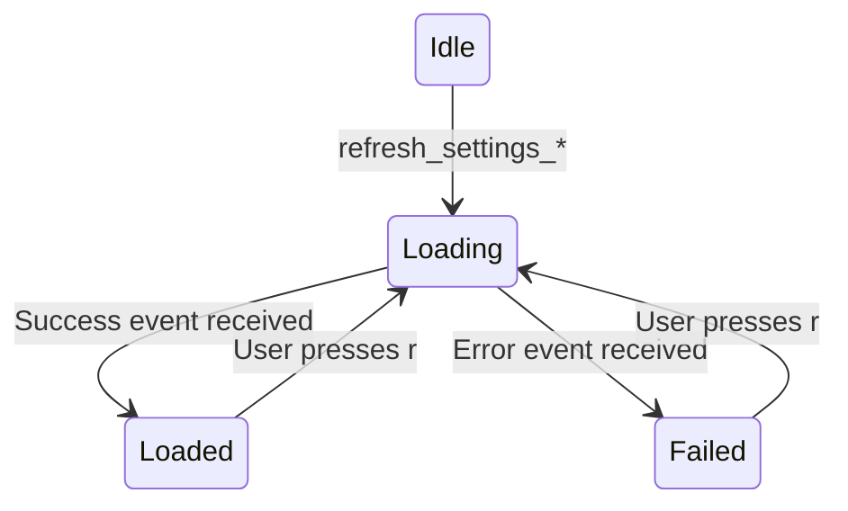

# Typed LoadState for TUI Settings Fetchers

## Problem

The Settings screen uses a single `loading: bool` shared across three sub-tabs (Providers, Models, Tools). Fetch threads silently swallow errors — if the daemon is down or a request fails, no event is sent, `loading` stays `true` forever or gets cleared by an unrelated sub-tab's success event, and the user sees either a permanent spinner or "No X available" with no indication of what went wrong.

## Design



Three files change. One new enum. Three new event variants. No new dependencies.

## Changes

### 1. `settings.rs` — LoadState enum + per-sub-tab state

[crates/openfang-cli/src/tui/screens/settings.rs](crates/openfang-cli/src/tui/screens/settings.rs)

**Add `LoadState` enum** near the top of the file (after `SettingsSub`):

```rust
#[derive(Default)]
pub enum LoadState {
    #[default]
    Idle,
    Loading,
    Loaded,
    Error(String),
}

impl LoadState {
    pub fn is_loading(&self) -> bool {
        matches!(self, LoadState::Loading)
    }
    pub fn error_msg(&self) -> Option<&str> {
        match self {
            LoadState::Error(msg) => Some(msg),
            _ => None,
        }
    }
}
```

**Replace fields in `SettingsState`:**

- Remove: `pub loading: bool`
- Add:
  - `pub providers_state: LoadState`
  - `pub models_state: LoadState`
  - `pub tools_state: LoadState`

Keep `tick` for spinner animation.

**Update `new()`** — all three default to `LoadState::Idle` (via `Default`).

**Update `draw_providers`** — replace `state.loading && state.providers.is_empty()` with:

```rust
match &state.providers_state {
    LoadState::Loading if state.providers.is_empty() => { /* spinner */ }
    LoadState::Error(msg) if state.providers.is_empty() => { /* error message + retry hint */ }
    _ if state.providers.is_empty() => { /* "No providers available." */ }
    _ => { /* render list */ }
}
```

Error rendering: red X icon + error message + dim "(r) retry" hint. Same style as the existing `test_result` failure rendering in `draw_providers`.

**Update `draw_models`** — same pattern using `state.models_state`.

**Update `draw_tools`** — same pattern using `state.tools_state`. This also fixes the existing bug where tools never showed a loading spinner.

### 2. `event.rs` — Error event variants + failure propagation

[crates/openfang-cli/src/tui/event.rs](crates/openfang-cli/src/tui/event.rs)

**Add three event variants to `AppEvent`** (near the existing `SettingsModelsLoaded` etc.):

```rust
SettingsProvidersFailed(String),
SettingsModelsFailed(String),
SettingsToolsFailed(String),
```

**Update `spawn_fetch_providers`** — wrap the daemon path so failures send the error event:

```rust
BackendRef::Daemon(base_url) => {
    let client = daemon_client();
    match client.get(format!("{base_url}/api/providers")).send() {
        Ok(resp) => match resp.json::<serde_json::Value>() {
            Ok(body) => {
                // ... existing parse logic ...
                let _ = tx.send(AppEvent::SettingsProvidersLoaded(providers));
            }
            Err(e) => {
                let _ = tx.send(AppEvent::SettingsProvidersFailed(
                    format!("Invalid response: {e}")
                ));
            }
        },
        Err(e) => {
            let _ = tx.send(AppEvent::SettingsProvidersFailed(
                format!("Connection failed: {e}")
            ));
        }
    }
}
```

**Update `spawn_fetch_models`** — same `match` pattern, sending `SettingsModelsFailed`.

**Update `spawn_fetch_tools`** — same `match` pattern, sending `SettingsToolsFailed`.

### 3. `mod.rs` — Handle error events + update refresh methods

[crates/openfang-cli/src/tui/mod.rs](crates/openfang-cli/src/tui/mod.rs)

**Handle new events in `handle_event`** (after the existing `SettingsModelsLoaded` arm):

```rust
AppEvent::SettingsProvidersFailed(msg) => {
    self.settings.providers_state = settings::LoadState::Error(msg);
}
AppEvent::SettingsModelsFailed(msg) => {
    self.settings.models_state = settings::LoadState::Error(msg);
}
AppEvent::SettingsToolsFailed(msg) => {
    self.settings.tools_state = settings::LoadState::Error(msg);
}
```

**Update existing loaded handlers** to set the typed state:

```rust
AppEvent::SettingsProvidersLoaded(providers) => {
    self.settings.providers = providers;
    // ... existing list selection logic ...
    self.settings.providers_state = settings::LoadState::Loaded;
}
```

Same for `SettingsModelsLoaded` and `SettingsToolsLoaded`.

**Update refresh methods** to set per-sub-tab loading state:

- `refresh_settings_providers`: `self.settings.providers_state = LoadState::Loading`
- `refresh_settings_models`: `self.settings.models_state = LoadState::Loading`
- `refresh_settings_tools`: `self.settings.tools_state = LoadState::Loading`

## What this fixes

- **Silent failure**: Fetch errors are always propagated and displayed
- **Shared state race**: Each sub-tab tracks its own lifecycle independently
- **Stuck spinner**: Loading state always transitions to either Loaded or Error
- **Missing tools spinner**: Tools sub-tab now has loading/error states
- **No user recourse**: Error state shows what failed and how to retry

## Commit

Single commit: `fix(tui): add typed LoadState per settings sub-tab with error propagation`

Then rebuild and deploy.
