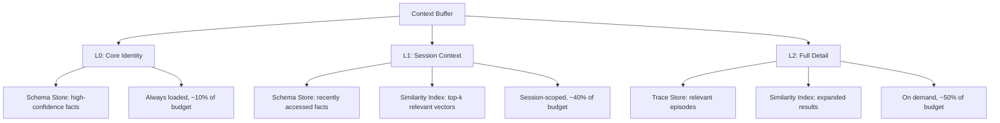
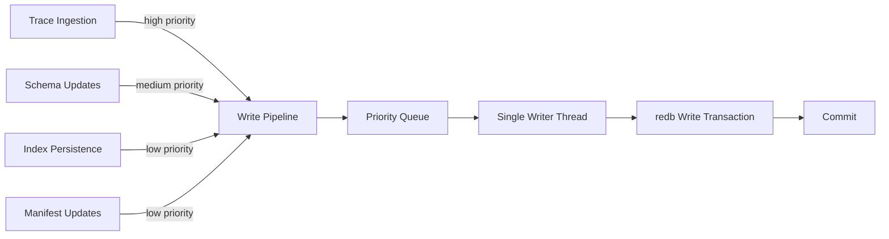

# Backend Architecture

_Exploring how `redb`, `usearch`, and `petgraph` compose into a coherent storage substrate for Mind, drawing on patterns extracted from SurrealDB, SurrealKV, and redb internals._

---

## 1. Introduction

This document explores the backend architecture for Mind — how the three storage primitives (`redb`, `usearch`, `petgraph`) compose into a system that supports append-only epistemic history, fast point lookups, vector similarity, and graph associations, all within a single self-contained binary.

We are writing this through the lens of SurrealDB's internal architecture, which we have reverse-engineered from its public source. SurrealDB is not a dependency (BSL 1.1 licensing), but its patterns are instructive: how it manages lock-free commits, persists HNSW graphs to KV, separates value from expression, and coordinates writes across subsystems. Where SurrealDB's patterns apply, we say so. Where they don't, we explain why.

This is an exploration, not a specification. Multiple viable approaches exist for most design questions. We present the reasoning behind each trade-off rather than locking in a decision.

**Source documents:**

- `docs/foundations.md` — locked-in decisions
- `docs/exploration.md` — cognitive model hypotheses
- `docs/research-redb.md` — redb internals
- `docs/research-surrealkv.md` — SurrealKV commit pipeline, compaction, integrity
- `docs/research-surrealdb-hnsw.md` — SurrealDB's HNSW implementation
- `docs/research-surrealdb-multi-model-query.md` — SurrealDB's multi-model and query engine patterns
- `docs/mind_transcript_breakdown.md` — Heuristic Swarm, model lifecycle, trace semantics

---

## 2. The Unified Storage Layer

### The Composition Problem

Mind uses three separate storage primitives, each optimized for a different access pattern:

| Primitive | Access Pattern | Role |
|-----------|---------------|------|
| `redb` | Key-value, range scans, ACID | Trace Store, Schema Store, metadata |
| `usearch` | Approximate nearest neighbor | Similarity Index |
| `petgraph` | Graph traversal, association | In-memory graph of relationships |

SurrealDB took a different approach: a single KV store (SurrealKV) with multiple query interpretations layered on top. Document, graph, relational, and KV models all share the same underlying storage, differing only in how the query engine interprets keys (`docs/research-surrealdb-multi-model-query.md`, Pattern 1). This eliminates synchronization problems — there is only one source of truth — but constrains all models to the same access patterns.

Mind's approach is the opposite: separate stores, each purpose-built. This trades implementation complexity (coordinating writes across stores, maintaining consistency) for the ability to use optimal data structures for each subsystem. A B-tree is not an HNSW graph, and pretending otherwise (by storing vectors as KV entries and implementing ANN on top) would sacrifice the performance characteristics that make `usearch` worth using.

**Open question:** Is the coordination overhead worth it? SurrealDB's single-KV approach is simpler to reason about. Mind's approach is more performant per-subsystem but harder to keep consistent. The answer depends on how tightly coupled the subsystems turn out to be in practice.

### One redb Database or Many?

redb supports multiple tables within a single database file, all committed atomically. The question is whether to use:

**Option A: One redb database, prefixed tables.**

```text
trace_entries     — append-only epistemic timeline
schema_facts      — O(1) point lookups
schema_metadata   — confidence, provenance, last-accessed
graph_nodes       — petgraph node serialization
graph_edges       — petgraph edge serialization
index_state       — HNSW graph metadata (entry point, counters)
index_vectors     — serialized vector data
index_neighbors   — per-node edge lists
consolidation_log — consolidation state machine
```

Advantages: single write transaction spans all tables (atomic cross-table updates). One file to manage. Simpler crash recovery.

Disadvantages: the single-writer constraint applies globally — a write to the trace blocks a write to the schema store. Compaction affects everything.

**Option B: Separate redb databases per subsystem.**

```text
trace.redb        — Trace Store tables
schema.redb       — Schema Store tables
graph.redb        — petgraph persistence
index.redb        — Similarity Index metadata
```

Advantages: independent write transactions (trace ingestion doesn't block consolidation). Independent compaction. Failure isolation (corruption in one database doesn't affect others).

Disadvantages: no atomic cross-database transactions. More files to manage. Crash recovery must handle partial states across databases.

**Option C: Hybrid — one database for core stores, separate for high-write subsystems.**

```text
mind.redb         — trace_entries, schema_facts, schema_metadata, consolidation_log
graph.redb        — petgraph persistence (low write volume)
index.redb        — HNSW persistence (batched writes)
```

This is what we are currently leaning toward. The rationale: the trace and schema stores are tightly coupled (consolidation promotes from trace to schema, requiring atomicity). The graph and index stores are more independent and benefit from write isolation.

**Open question:** Does the single-writer constraint actually matter in practice? If writes are batched through a commit pipeline (Section 9), the contention window may be small enough that Option A works fine. The answer requires benchmarking with realistic write patterns.

### petgraph Persistence

`petgraph` is an in-memory data structure. It does not persist across restarts. We need a strategy for serializing graph state to redb and reconstructing it on startup.

Two approaches, inspired by SurrealDB's per-node KV persistence (`docs/research-surrealdb-hnsw.md`, Section 2):

**Option A: Per-node serialization.** Each node and its adjacency list is stored as an independent redb entry. On startup, iterate all entries and reconstruct the graph. This allows incremental saves — only modified nodes need to be written.

```rust
// Conceptual key layout
// graph_nodes:  NodeId -> NodeData
// graph_edges:  (NodeId, NodeId) -> EdgeWeight
```

Advantages: incremental saves, efficient for sparse updates, parallelizable reads on startup.

Disadvantages: many small redb entries (space overhead from redb's per-entry overhead), startup requires a full scan.

**Option B: Snapshot serialization.** The entire graph is serialized to a single redb value (e.g., via `serde` or a custom binary format). On startup, deserialize the whole thing.

Advantages: single redb entry, simple implementation.

Disadvantages: every modification requires rewriting the entire graph snapshot. Not viable for large graphs.

**Option C: Chunked snapshots with a dirty-node overlay.** Store a base snapshot plus a set of dirty-node deltas. Periodically compact the snapshot.

This is more complex but avoids both the per-entry overhead and the full-rewrite cost. Whether it's worth the complexity depends on graph size and mutation frequency.

**Open question:** How large will the association graph be? If it stays small (thousands of nodes), Option B is fine. If it grows to millions of nodes, Option A or C becomes necessary. We don't know yet because we haven't defined what gets stored in the graph.

---

## 3. Trace Store Design

The Trace Store is the immutable, append-only epistemic timeline. It records every state the system has ever been in: what was believed, when, what triggered a change, and the reasoning behind it. It is not a retrieval system — it is a pure chronicle.

### redb Table Layout

The trace is time-ordered and append-only. redb's B-tree naturally supports this via range scans on time-ordered keys.

**Option A: Monotonic timestamp keys.**

```rust
const TRACE_TABLE: TableDefinition<u64, TraceEntry> = TableDefinition::new("trace_entries");

struct TraceEntry {
    content: Vec<u8>,        // serialized entry content
    source: TraceSource,     // ingestion, consolidation, inquiry, external
    checksum: u32,           // CRC32 of content
}
```

Key: monotonically increasing timestamp (nanoseconds since epoch, or a logical sequence number). Append by inserting with the next timestamp. Range scan for time-bounded reads.

Advantages: simple, natural ordering, efficient range scans.

Disadvantages: no structure in the key beyond time. If we need bitemporal queries (see below), this layout doesn't support them directly.

**Option B: Composite bitemporal keys.**

```rust
// Key = (valid_from, learned_at)
// valid_from: when this belief became true (epistemic time)
// learned_at: when the system learned it (system time)
const TRACE_TABLE: TableDefinition<(u64, u64), TraceEntry> = TableDefinition::new("trace_entries");
```

This encodes both "when was this true" and "when did the system learn it" in the key, enabling bitemporal range scans. Inspired by XTDB's bitemporal indexing (`docs/research.md`, XTDB section).

Advantages: supports the bitemporal question directly. Can scan "what did the system believe at time T" or "what was learned during window W."

Disadvantages: composite keys are larger (16 bytes vs 8 bytes). More complex key design. The bitemporal semantics need careful definition — does `valid_from` change when a belief is revised?

**Open question:** Is bitemporality needed at the storage level, or can it be reconstructed from a simpler append-only log? The trace records every state change with a timestamp. To answer "what did the system believe at time T," you scan backwards from T until you find the most recent entry for each belief. This is O(n) without an index — but the trace is not queryable by design. Internal processes (consolidation, dreaming) that need to read the trace can afford to do full scans during idle time.

We are tentatively leaning toward Option A (simple timestamp keys) unless bitemporal queries become a concrete performance bottleneck during consolidation.

### Batching Trace Writes

The trace is the primary write path. New experiences arrive continuously and must be appended. SurrealKV's commit pipeline (`docs/research-surrealkv.md`, Section 4) offers a pattern:

```text
Phase 1 (Serialized):  Acquire write lock → assign sequence number → write to WAL → enqueue
Phase 2 (Concurrent): Apply batch to active data structure (lock-free)
Phase 3 (Multi-consumer): Publish visibility → complete waiters
```

We can adapt this for redb's single-writer model:

```rust
struct TraceWriter {
    pending: crossbeam::queue::ArrayQueue<TraceEntry>,
    write_tx: Mutex<Option<WriteTransaction>>,
    notify: Notify,
}

impl TraceWriter {
    fn enqueue(&self, entry: TraceEntry) -> u64 {
        let seq = self.next_seq.fetch_add(1, Ordering::Relaxed);
        self.pending.push(entry).expect("queue full");
        self.notify.notify_one();
        seq
    }

    fn flush_loop(&self, db: &Database) {
        loop {
            self.notify.notified().await;
            let batch: Vec<_> = drain_queue(&self.pending);
            if batch.is_empty() { continue; }

            let write_txn = db.begin_write().unwrap();
            let mut table = write_txn.open_table(TRACE_TABLE).unwrap();
            for (seq, entry) in batch {
                table.insert(seq, &entry).unwrap();
            }
            write_txn.commit().unwrap();
        }
    }
}
```

The enqueue path is lock-free (atomic sequence number + bounded queue). The flush path acquires redb's write transaction and batches multiple entries into a single commit. Readers (consolidation, dreaming) see the batch atomically when the commit completes.

**Open question:** What happens when the pending queue fills up? SurrealKV uses write stall backpressure (`docs/research-surrealkv.md`, Section 5) — stall new writes when compaction falls behind. We need an analogous mechanism: either block the enqueue caller, drop entries (unacceptable for epistemic history), or spill to a temporary buffer.

### CRC32 Integrity Checks

SurrealKV uses masked CRC32 for block checksums (`docs/research-surrealkv.md`, Section 1). The masking (rotate + delta) detects common corruption patterns that plain CRC32 misses.

We are exploring applying this at the trace entry level rather than the block level (redb already handles page-level integrity via XXH3):

```rust
fn masked_crc32(data: &[u8]) -> u32 {
    let crc = crc32fast::hash(data);
    (crc.rotate_left(17)).wrapping_add(0x63504253)
}
```

Each `TraceEntry` stores its own checksum. On read, verify the checksum. If it fails, the entry is corrupted — log it, flag it, but do not delete it (the trace is immutable).

**Open question:** Is entry-level CRC32 redundant with redb's page-level XXH3? It protects against different failure modes: XXH3 catches page-level corruption, CRC32 catches application-level corruption (e.g., a bug in serialization). The overhead is 4 bytes per entry. For an epistemic history, the extra safety seems worth it, but we haven't quantified the failure modes.

### Reading the Trace

The trace is not queryable. But internal processes need to read it:

- **Consolidation** scans the trace to find patterns worth promoting to the schema store.
- **Dreaming** runs inference against trace entries to find contradictions, associations, and salience shifts.
- **Concordance** builds embeddings from trace content for the similarity index.

All of these are background processes that run during idle time. They can afford full scans. The constraint is that they must not block trace ingestion — redb's MVCC allows concurrent reads alongside a single writer, so this should work naturally.

**Open question:** How does consolidation track its position in the trace? If it scans from the beginning every time, it becomes O(n²) over the system's lifetime. We need a cursor or watermark — "consolidation has processed up to trace sequence N." This watermark must itself be stored durably (in redb), and it must be updated atomically with any schema store changes that result from consolidation.

---

## 4. Schema Store Design

The Schema Store is the fast KV fact layer — crystallized patterns that don't need to be reconstructed from the trace every time. Inspired by the DeepSeek Engram principle: not all knowledge requires dynamic computation (`docs/research.md`, DeepSeek Engram section).

### redb Table Layout

The schema store needs O(1) point lookups. redb's B-tree provides this — a single key lookup is O(log n) with a very small constant (typically 2-3 page reads for a well-cached tree).

**Key design: hash-based vs structured.**

**Option A: Hash-based keys (inspired by DeepSeek Engram).**

```rust
const SCHEMA_TABLE: TableDefinition<[u8; 32], SchemaEntry> =
    TableDefinition::new("schema_facts");

// Key = BLAKE3 hash of the fact's semantic content
// This gives O(1) lookup after hashing, and natural deduplication
```

Advantages: constant key size (32 bytes), natural deduplication (same fact = same key), no key collision issues (BLAKE3 is collision-resistant).

Disadvantages: no ordering in the key space — can't do range scans. If we need "all facts about topic X," we need a secondary index or a separate table.

**Option B: Structured keys.**

```rust
const SCHEMA_TABLE: TableDefinition<SchemaKey, SchemaEntry> =
    TableDefinition::new("schema_facts");

struct SchemaKey {
    domain: String,    // e.g., "user.preferences", "system.capabilities"
    predicate: String, // e.g., "prefers_dark_mode", "max_context_tokens"
}
```

Advantages: human-readable, supports range scans within a domain, easy to debug.

Disadvantages: variable key size, no deduplication, potential key conflicts.

**Option C: Hybrid — hash key + structured metadata.**

```rust
const SCHEMA_TABLE: TableDefinition<[u8; 32], SchemaEntry> =
    TableDefinition::new("schema_facts");
const SCHEMA_INDEX: MultimapTableDefinition<String, [u8; 32]> =
    TableDefinition::new("schema_domain_index");

// Primary lookup by hash, secondary lookup by domain
```

This gives O(1) primary lookups with the ability to enumerate facts within a domain via the multimap index.

We are leaning toward Option C. The hash key provides the Engram-like fast lookup. The domain index provides the navigability that structured keys offer. The cost is an extra multimap table and the need to keep it in sync.

**Open question:** What constitutes a "fact" in the schema store? Is it a simple key-value pair ("user prefers dark mode"), or does it carry provenance ("learned from conversation on 2026-03-20, confidence 0.9, last referenced 2 hours ago")? The richer the fact, the more complex the value encoding.

### Value Encoding

A `SchemaEntry` needs to carry more than just the fact itself:

```rust
struct SchemaEntry {
    content: Vec<u8>,            // serialized fact content
    confidence: f32,             // 0.0..1.0, how strongly the system holds this
    provenance: Provenance,      // where this fact came from
    learned_at: u64,             // when it entered the schema store
    last_accessed: u64,          // last time it was loaded into context
    access_count: u64,           // how many times it's been referenced
    trace_origin: u64,           // trace sequence number that produced this fact
    schema_version: u32,         // for forward-compatible serialization
}

enum Provenance {
    Consolidation { trace_range: (u64, u64) },
    External { source: String },
    Bootstrap { reason: String },
}
```

This is inspired by SurrealDB v3.0's document wrapper pattern (`docs/research-surrealdb-multi-model-query.md`, Pattern 5): separating content from metadata at the storage level avoids the "hidden fields" problem where metadata pollutes the content.

**Open question:** Should `confidence` and `access_count` be updated in-place (mutating the schema entry) or appended (creating a new version)? In-place updates are simpler but lose history. Appending preserves history but complicates lookups (need to find the latest version). The trace already records the history of belief changes — the schema store might not need to.

### Promotion from Trace to Schema

How does something get promoted from the trace (episodic) to the schema (semantic)?

The consolidation process (Section 7) scans the trace and identifies patterns that are stable enough to crystallize. The criteria might include:

- **Repetition:** The same fact appears in multiple trace entries across different contexts.
- **Salience:** The fact has been referenced frequently in recent trace entries.
- **Stability:** The fact has not been contradicted within a time window.
- **Confidence:** A heuristic swarm model has scored this pattern above a threshold.

This is directly analogous to SurrealKV's score-based compaction (`docs/research-surrealkv.md`, Section 5), but applied to epistemic promotion rather than storage reorganization.

```rust
struct PromotionCandidate {
    fact_hash: [u8; 32],
    content: Vec<u8>,
    score: f32,           // composite of repetition, salience, stability
    trace_evidence: Vec<u64>,  // trace sequence numbers supporting this
}
```

**Open question:** Can promotion be reversed? If a crystallized fact is contradicted, does it get demoted back to the trace? The immutable trace already records the contradiction. The schema entry could be marked as `superseded` with a pointer to the contradicting trace entry. But this starts to look like a versioned store — which is exactly the kind of complexity we are trying to avoid in the schema layer.

---

## 5. Similarity Index Design

The Similarity Index provides vector similarity search via `usearch`. It is informed by SurrealDB's HNSW implementation (`docs/research-surrealdb-hnsw.md`), though Mind uses `usearch` (a separate library) rather than a custom HNSW implementation.

### Two-Phase Write Architecture

SurrealDB's HNSW uses a two-phase write pattern (`docs/research-surrealdb-hnsw.md`, Section 3):

1. **Phase 1 — Enqueue:** Lock-free, atomic sequencing. Document changes are converted to pending updates.
2. **Phase 2 — Apply:** Background task drains the pending queue, acquires the write lock, applies mutations to the in-memory graph, and persists the result.

We are exploring the same pattern for Mind:

```rust
struct SimilarityIndex {
    index: RwLock<usearch::Index>,     // the HNSW graph
    pending: SegQueue<PendingVector>,   // lock-free enqueue
    next_id: AtomicU64,                 // monotonic element ID
    cache: VectorCache,                 // weighted LRU for hot vectors
}

struct PendingVector {
    id: u64,
    vector: Vec<f32>,
    hash: [u8; 32],     // BLAKE3 for deduplication
    operation: VectorOp, // Insert or Remove
}

enum VectorOp {
    Insert,
    Remove,
}
```

The enqueue path is lock-free — any subsystem can submit vectors for indexing without blocking. The apply path runs as a background task that batches pending operations and applies them to the `usearch` index.

**Open question:** How does the apply path interact with redb's single-writer constraint? The HNSW graph lives in memory (`usearch`), but its state must be persisted to redb for crash recovery. The apply path needs to:

1. Modify the in-memory `usearch` index.
2. Persist the changes to redb.
3. Do both atomically.

Step 2 requires a redb write transaction, which means it must go through the write coordination layer (Section 9).

### Per-Node Persistence

SurrealDB persists each HNSW node's edge list as an independent KV entry (`docs/research-surrealdb-hnsw.md`, Section 2). This allows incremental saves and efficient loading.

We are exploring the same approach for `usearch`:

```rust
// redb tables for HNSW persistence
const INDEX_STATE: TableDefinition<&str, IndexState> =
    TableDefinition::new("index_state");
const INDEX_VECTORS: TableDefinition<u64, Vec<f32>> =
    TableDefinition::new("index_vectors");
const INDEX_NEIGHBORS: TableDefinition<(u64, u32), Vec<u64>> =
    TableDefinition::new("index_neighbors");
// (node_id, layer) -> list of neighbor node_ids

struct IndexState {
    entry_point: Option<u64>,
    next_element_id: u64,
    dimension: u16,
    count: u64,
}
```

On startup, reconstruct the `usearch` index by loading `INDEX_STATE`, then iterating `INDEX_VECTORS` and `INDEX_NEIGHBORS` to rebuild the graph. This is slower than loading a monolithic snapshot, but it allows incremental saves during normal operation.

**Open question:** `usearch` has its own serialization format (`usearch::Index::save()` / `load()`). Should we use that instead of per-node persistence? The built-in format is simpler but opaque — we can't inspect or incrementally update it. Per-node persistence gives us more control but requires keeping our serialization in sync with `usearch`'s internal graph structure.

### Eager Deletion

SurrealDB's HNSW uses eager deletion with no tombstones (`docs/research-surrealdb-hnsw.md`, Section 7):

1. Disconnect the node from all neighbors.
2. Reconnect each former neighbor via local search.
3. Persist the modified neighbors.
4. Update the entry point if needed.

We are exploring the same approach. When a vector is removed (e.g., a schema entry is demoted), the corresponding HNSW node is immediately removed and its neighbors are reconnected. No tombstones, no lazy garbage collection.

The cost is that deletion is O(m * ef) where m is the max connections and ef is the search width. For the expected scale of Mind's index (thousands to low millions of vectors), this is acceptable.

**Open question:** Does `usearch` support eager deletion natively? If it does, we should use its built-in removal rather than implementing our own neighbor reconnection. If it uses lazy deletion internally, we need to understand the implications for index quality over time.

### Vector Cache

SurrealDB uses a weighted LRU cache (`quick_cache`) for hot vectors (`docs/research-surrealdb-hnsw.md`, Section 6). The cache is sized by memory (default 256 MiB) rather than entry count, and each entry's weight is computed from the vector's memory footprint.

We are exploring a similar cache for Mind:

```rust
struct VectorCache {
    inner: quick_cache::sync::Cache<[u8; 32], Vec<f32>>,
    max_bytes: usize,
}

struct VectorWeighter;

impl quick_cache::Weighter<[u8; 32], Vec<f32>> for VectorWeighter {
    fn weight(&self, _key: &[u8; 32], value: &Vec<f32>) -> usize {
        value.len() * std::mem::size_of::<f32>() + 64 // data + overhead
    }
}
```

The cache sits between the similarity index and redb. Hot vectors (frequently accessed during consolidation or context loading) are served from memory. Cold vectors are loaded from redb on demand.

**Open question:** What is the right cache size? SurrealDB defaults to 256 MiB. For Mind, the answer depends on the embedding dimension and the expected working set. With 768-dimensional f32 vectors (~3 KiB each), 256 MiB holds ~87,000 vectors. With 1536-dimensional vectors (~6 KiB each), ~43,000 vectors. Whether this is enough depends on how the Context Buffer uses the index.

### BLAKE3 Vector Deduplication

SurrealDB uses BLAKE3 hashing to identify duplicate vectors (`docs/research-surrealdb-hnsw.md`, Section 3). Multiple documents with the same embedding share a single HNSW node.

We are exploring the same approach:

```rust
fn vector_hash(vector: &[f32]) -> [u8; 32] {
    let bytes: &[u8] = unsafe {
        std::slice::from_raw_parts(
            vector.as_ptr() as *const u8,
            vector.len() * std::mem::size_of::<f32>(),
        )
    };
    blake3::hash(bytes).into()
}
```

When inserting a vector, compute its hash and check if it already exists in the index. If it does, increment a reference count rather than creating a new HNSW node. On removal, decrement the reference count and only remove the node when it reaches zero.

**Open question:** How likely are exact vector duplicates in practice? Embeddings from the same text with the same model should produce identical vectors. But embeddings from similar (not identical) text will be close but not exact. The deduplication only helps with exact duplicates — which may be rare enough that the overhead (hash computation + reference counting) isn't worth it.

---

## 6. Context Buffer Design

The Context Buffer is the working memory — the mechanism that loads the right subset of stored knowledge into the LLM's context window. It reads from all three stores (trace, schema, similarity index) and assembles a context that fits within the token budget.

### Tiered Loading (L0/L1/L2)

Inspired by OpenViking's tiered retrieval model (`docs/research.md`, OpenViking section):



- **L0 (Core Identity):** Always present. High-confidence schema facts that define the system's current self-model. Small, stable, ~10% of the context budget.
- **L1 (Session Context):** Loaded per interaction. Recently accessed schema facts, top-k similarity results for the current query. ~40% of budget.
- **L2 (Full Detail):** Loaded on demand. Relevant trace episodes, expanded similarity results. ~50% of budget.

**Open question:** Are these the right proportions? The answer depends on the LLM's context window size and the granularity of stored knowledge. A 128K context window has very different constraints than a 4K window. We are assuming a modern large-context model, but the tiered design should adapt to any window size.

### Streaming Retrieval Pipeline

SurrealDB v3.0 introduced a streaming execution pipeline (`docs/research-surrealdb-multi-model-query.md`, Pattern 6): intermediate results are not fully materialized, reducing memory pressure.

We are exploring a similar approach for the Context Buffer:

```rust
struct ContextBuffer {
    budget: usize,  // max tokens
}

impl ContextBuffer {
    fn assemble(&self, query: &Query) -> impl Stream<Item = ContextChunk> {
        let l0 = self.load_l0();  // always present
        let l1 = self.load_l1(query);  // query-dependent
        let l2 = self.load_l2(query, &l1);  // expanded detail

        async_stream::stream! {
            for chunk in l0 { yield chunk; }
            for chunk in l1 { yield chunk; }
            for chunk in l2 { yield chunk; }
        }
    }
}
```

Each tier is loaded as a stream of chunks. The buffer tracks token usage as chunks are yielded and can stop early if the budget is exhausted. This avoids materializing the full context set before trimming.

**Open question:** How does the buffer handle priority? If L2 produces a highly relevant trace episode, should it displace a less relevant L1 schema fact? This requires a scoring mechanism that operates across tiers — which starts to look like the orchestrator's job (Section 8).

### Reading Without Blocking Writes

redb's MVCC allows multiple concurrent read transactions alongside a single writer. The Context Buffer opens a read transaction and holds it for the duration of context assembly. Meanwhile, the trace can continue appending, the schema store can continue updating, and the similarity index can continue indexing.

The constraint is that the Context Buffer sees a snapshot of the stores at the time the read transaction began. If new data arrives mid-assembly, it won't be included. This is acceptable — the context is assembled from the system's best understanding at the time of the query.

**Open question:** How long does a read transaction stay open? If context assembly is slow (e.g., waiting for similarity search results), the read transaction holds a snapshot that prevents redb from reclaiming old pages. We need to ensure read transactions are short-lived, or use savepoints to release snapshots incrementally.

---

## 7. Consolidator Design

The Consolidator is the background reorganization process — the "dream state." It scans the immutable trace, identifies patterns worth promoting to the schema store, resolves contradictions, and updates the similarity index.

### Score-Based Consolidation Triggers

Inspired by SurrealKV's score-based leveled compaction (`docs/research-surrealkv.md`, Section 5), we are exploring a scoring mechanism for consolidation triggers:

```rust
struct ConsolidationScore {
    new_entries: u64,        // trace entries since last consolidation
    pending_promotions: u32, // candidates above promotion threshold
    contradiction_count: u32, // detected by heuristic swarm
    time_since_last: Duration,
    salience_drift: f32,     // how much salience scores have shifted
}

impl ConsolidationScore {
    fn should_consolidate(&self) -> bool {
        self.new_entries > ENTRY_THRESHOLD
            || self.pending_promotions > PROMOTION_THRESHOLD
            || self.contradiction_count > CONTRADICTION_THRESHOLD
            || self.time_since_last > MAX_IDLE_DURATION
            || self.salience_drift > DRIFT_THRESHOLD
    }
}
```

Multiple triggers, any one of which can initiate consolidation. This prevents consolidation from being purely time-based (which might miss important patterns) or purely event-based (which might not trigger during quiet periods).

**Open question:** What are the right thresholds? They depend on the write rate and the cost of consolidation. Too aggressive, and consolidation runs constantly, competing with ingestion for write access. Too conservative, and the schema store becomes stale. We expect these to be tunable parameters, possibly adapted by the heuristic swarm over time.

### The Consolidation Loop

```text
1. Acquire read snapshot of trace (from watermark to tip)
2. Run heuristic swarm models:
   a. Contradiction detector: find conflicting beliefs
   b. Pattern extractor: identify repeated, stable patterns
   c. Salience ranker: score patterns by importance
   d. Curiosity scorer: identify novel, under-explored patterns
3. For each promotion candidate (score > threshold):
   a. Check schema store for existing entry (dedup)
   b. If new: insert into schema store
   c. If existing: update confidence, provenance
4. Generate embeddings for new/updated schema entries
5. Update similarity index
6. Update consolidation watermark
7. Record consolidation run in trace
```

Step 7 is important: the consolidation run itself becomes a trace entry. This creates an audit trail — you can always see what the consolidator changed and why.

### The Single-Writer Problem

redb allows only one write transaction at a time. The Consolidator needs to write to the schema store, the similarity index metadata, and the consolidation watermark. The Orchestrator needs to write to the trace (ingestion). These can't happen simultaneously.

Options:

**Option A: Serialized with priority.** The Orchestrator always has priority (ingestion must not be blocked). The Consolidator acquires the write lock only when the Orchestrator is idle.

```rust
struct WriteCoordinator {
    db: Database,
    writer: Mutex<()>,
    orchestrator_waits: AtomicBool,
}

impl WriteCoordinator {
    fn acquire_for_consolidation(&self) -> Option<WriteTransaction> {
        if self.orchestrator_waits.load(Ordering::Relaxed) {
            return None; // orchestrator needs the lock, yield
        }
        let guard = self.writer.try_lock()?;
        Some(self.db.begin_write().unwrap())
    }
}
```

**Option B: Commit pipeline (from SurrealKV).** All writes go through a single pipeline that serializes them. The pipeline has a priority queue — trace writes are high priority, consolidation writes are low priority.

**Option C: Separate databases.** If the trace and schema stores are in separate redb databases (Option B from Section 2), they can write concurrently. The cost is losing atomic cross-table transactions.

We are exploring Option A as the initial approach, with Option B as an evolution if contention becomes a problem. Option C is the nuclear option — it solves the problem but introduces consistency challenges.

**Open question:** How often does consolidation actually need to write? If consolidation runs infrequently (e.g., once per idle period) and batches all its writes into a single transaction, the contention window is small. The single-writer problem may be theoretical rather than practical.

### Salience-Weighted Promotion

Adapting SurrealKV's score-based compaction to epistemic promotion:

```rust
struct PromotionScore {
    repetition: f32,    // how often this pattern appears in the trace
    recency: f32,       // how recently it appeared
    stability: f32,     // how long it's been uncontradicted
    salience: f32,      // heuristic swarm's salience assessment
    diversity: f32,     // how different this is from existing schema entries
}

impl PromotionScore {
    fn composite(&self) -> f32 {
        0.25 * self.repetition
            + 0.20 * self.recency
            + 0.25 * self.stability
            + 0.20 * self.salience
            + 0.10 * self.diversity
    }
}
```

The weights are exploratory. The heuristic swarm may adjust them over time based on which promoted facts turn out to be useful (measured by access frequency in the context buffer).

### Atomic Manifest Updates

SurrealKV uses atomic manifest updates for crash-safe metadata (`docs/research-surrealkv.md`, Section 6): a changeset is written atomically, and if the write fails, the previous state is rolled back.

We are exploring the same pattern for consolidation state:

```rust
const CONSOLIDATION_MANIFEST: TableDefinition<&str, ConsolidationManifest> =
    TableDefinition::new("consolidation_manifest");

struct ConsolidationManifest {
    watermark: u64,              // last processed trace sequence
    last_run: u64,               // timestamp of last consolidation
    promoted_count: u32,         // entries promoted in last run
    contradictions_resolved: u32,
    schema_version: u32,         // for forward compatibility
}
```

The manifest is updated atomically with the schema store changes in a single write transaction. If the transaction fails (crash, error), neither the schema changes nor the manifest update are applied. On restart, the consolidator reads the manifest and resumes from the last watermark.

### The Inquiry-Reconsolidation Loop

The feedback loop described in the transcript (`docs/mind_transcript_breakdown.md`, Section 6):

1. Inquiry surfaces (contradiction detected, or deliberate belief downgrade).
2. The system enters an exploratory state — existing beliefs are treated as hypotheses.
3. The consolidator re-examines trace evidence for the destabilized beliefs.
4. New understanding is formed and crystallized in the schema store.
5. The reconsolidated understanding becomes the new operational baseline.

This loop is the growth mechanism. It requires the consolidator to be able to:

- Demote schema entries (reduce confidence, mark as superseded).
- Re-examine trace evidence for specific beliefs (not just full scans).
- Write new schema entries that supersede old ones.

**Open question:** How does inquiry trigger consolidation? If inquiry is emergent (not mechanical), the trigger must come from the heuristic swarm's contradiction detector or from the orchestrator's metacognitive evaluation. The consolidator itself doesn't decide when to enter inquiry mode — it responds to signals from the swarm.

---

## 8. Orchestrator Design

The Orchestrator is the memory management layer — not an agent with autonomous goals, but a router that manages the Context Buffer, coordinates the heuristic swarm, and records experiences.

### Query Routing

The Orchestrator routes queries to the appropriate stores:

```rust
enum OrchestratorRequest {
    Ingest { content: Vec<u8>, source: TraceSource },
    Query { text: String, budget: usize },
    UpdateSchema { fact: SchemaEntry },
    TriggerInquiry { belief_hash: [u8; 32] },
}

impl Orchestrator {
    fn handle(&self, request: OrchestratorRequest) {
        match request {
            OrchestratorRequest::Ingest { content, source } => {
                self.trace_writer.enqueue(TraceEntry::new(content, source));
                self.swarm.submit(SwarmTask::ExtractPatterns { content });
            }
            OrchestratorRequest::Query { text, budget } => {
                let embedding = self.inference.embed(&text);
                let context = self.context_buffer.assemble(&embedding, budget);
                return context;
            }
            // ...
        }
    }
}
```

The Orchestrator does not implement query logic itself — it delegates to the subsystems. It is a coordinator, not a compute engine.

### Value-Expression Separation

SurrealDB v3.0 separates values (what data IS) from expressions (how data is DERIVED) (`docs/research-surrealdb-multi-model-query.md`, Pattern 3). This has a parallel in Mind:

- **Values (committed beliefs):** Schema store entries with high confidence. These are loaded into context as-is.
- **Expressions (active evaluation):** Beliefs under inquiry. These are not loaded directly — instead, the orchestrator loads the relevant trace evidence and lets the LLM evaluate them.

```rust
enum BeliefState {
    Asserted { entry: SchemaEntry },       // committed, load directly
    UnderInquiry { entry: SchemaEntry, evidence: Vec<TraceRef> }, // load with evidence
    Superseded { entry: SchemaEntry, replacement: [u8; 32] },    // skip or load replacement
}
```

This separation makes it clear which facts are operational truth and which are being questioned. The Context Buffer can prioritize asserted beliefs and allocate budget for inquiry evidence only when warranted.

**Open question:** How does the LLM know which beliefs are under inquiry? The context assembly must include metadata about belief states. Too much metadata wastes tokens. Too little, and the LLM can't reason about uncertainty. We need a compact encoding for belief states within the context.

### Heuristic Swarm Coordination

The Orchestrator coordinates the Heuristic Swarm — many tiny specialized models running inference across the system (`docs/mind_transcript_breakdown.md`, Section 7):

```rust
struct HeuristicSwarm {
    contradiction_detector: ModelHandle,
    pattern_extractor: ModelHandle,
    salience_ranker: ModelHandle,
    curiosity_scorer: ModelHandle,
    embedding_model: ModelHandle,
}

struct ModelHandle {
    model: Box<dyn InferenceModel>,
    watcher: WatcherHandle,
}

trait InferenceModel: Send + Sync {
    fn infer(&self, input: &[u8]) -> ModelOutput;
}

struct WatcherHandle {
    dataset_dir: PathBuf,
    threshold: f32,
    last_check: Instant,
}
```

Each model does one thing. The orchestrator submits tasks to the swarm and collects results. Models don't coordinate with each other — the orchestrator is the only coordination point.

The watcher mechanism (`docs/mind_transcript_breakdown.md`, Section 8) is separate from inference:

- Each model has a training dataset directory.
- A watcher checks if relevant new data has accumulated beyond a threshold.
- When triggered, the model is retrained in the background.
- Once validated, the running model is swapped out.

Models do inference; watchers do lifecycle management. The architecture handles the boundary.

### Assertion/Inquiry as Orchestration Behavior

The assertion/inquiry tension is not a state machine. It is not "the system is in assertion mode" or "the system is in inquiry mode." It is a parallel tension that the orchestrator manages:

```rust
struct CognitiveTension {
    assertion_level: f32,  // 0.0..1.0, default high
    inquiry_level: f32,    // 0.0..1.0, default low
}

impl CognitiveTension {
    fn update(&mut self, signals: &SwarmSignals) {
        // Inquiry surfaces when contradictions are detected
        if signals.contradiction_count > 0 {
            self.inquiry_level = (self.inquiry_level + 0.2).min(1.0);
        }
        // Inquiry surfaces when confidence is low
        if signals.avg_confidence < 0.5 {
            self.inquiry_level = (self.inquiry_level + 0.1).min(1.0);
        }
        // Assertion recovers over time if no contradictions
        if signals.contradiction_count == 0 {
            self.inquiry_level = (self.inquiry_level - 0.05).max(0.0);
        }
        // Tension is the gap between the two
    }

    fn tension(&self) -> f32 {
        (self.assertion_level - self.inquiry_level).abs()
    }
}
```

The tension score influences context assembly: higher tension means more trace evidence is included (to support inquiry), and schema facts are presented with confidence qualifiers.

**Open question:** Is this the right model? The transcript emphasizes that inquiry is "emergent" and "not mechanical." A formulaic update function feels mechanical. The alternative is to have the LLM itself evaluate whether inquiry is warranted — but this requires running the LLM on every interaction, which is expensive. The heuristic swarm is the compromise: cheap models make the initial assessment, and the full LLM is invoked only when the swarm signals high tension.

---

## 9. Write Coordination

This is the novel architectural challenge. redb allows only one write transaction at a time. Multiple subsystems need to write:

| Subsystem | Write Pattern | Frequency |
|-----------|--------------|-----------|
| Trace Store | Append entries | High (every interaction) |
| Schema Store | Insert/update facts | Medium (during consolidation) |
| Similarity Index | Persist graph state | Medium (batched, during consolidation) |
| Consolidation Manifest | Update watermark | Low (once per consolidation run) |

### The Commit Pipeline Pattern

Drawing from SurrealKV's three-phase commit pipeline (`docs/research-surrealkv.md`, Section 4), we are exploring a unified write pipeline for Mind:



```text
Phase 1 (Lock-free enqueue):
  - Each subsystem pushes write operations to a priority queue
  - Operations are tagged with priority and subsystem ID
  - Atomic sequencing ensures ordering within a subsystem

Phase 2 (Serialized apply):
  - Single writer thread drains the queue in priority order
  - Acquires redb write transaction
  - Applies all pending operations in a single transaction
  - Commits atomically

Phase 3 (Visibility publish):
  - Post-commit notification wakes waiting readers
  - Subsystems that submitted writes are notified of completion
```

```rust
struct WritePipeline {
    queue: SegQueue<PendingWrite>,
    priority: AtomicU64,  // monotonic priority counter
    writer: Mutex<()>,
    db: Database,
    notify: Notify,
}

struct PendingWrite {
    priority: u64,
    subsystem: SubsystemId,
    operation: Box<dyn FnOnce(&mut WriteTransaction) -> Result<(), Error> + Send>,
    completion: Option<oneshot::Sender<()>>,
}

enum SubsystemId {
    Trace,
    Schema,
    Index,
    Manifest,
}
```

The key insight from SurrealKV is that the enqueue path is lock-free. Any subsystem can submit writes at any time without blocking. The serialization happens in the writer thread, which batches operations and applies them in a single redb transaction.

### Priority and Backpressure

Priority ordering ensures that trace ingestion (high priority) is never blocked behind consolidation writes (low priority). But what happens when the queue grows faster than the writer can drain it?

SurrealKV uses write stall backpressure (`docs/research-surrealkv.md`, Section 5): when compaction falls behind, new writes are stalled until compaction catches up.

We are exploring a similar mechanism:

```rust
impl WritePipeline {
    fn enqueue(&self, write: PendingWrite) -> Result<(), EnqueueError> {
        if self.queue.len() > MAX_QUEUE_SIZE {
            if write.subsystem == SubsystemId::Trace {
                // Trace writes are never dropped, but may block
                self.wait_for_capacity().await;
            } else {
                // Non-critical writes can be rejected
                return Err(EnqueueError::Backpressure);
            }
        }
        self.queue.push(write);
        self.notify.notify_one();
        Ok(())
    }
}
```

Trace writes are never dropped (epistemic history must be complete). Consolidation writes can be deferred or rejected (they'll retry on the next cycle).

### The "God Byte" Question

redb uses a "god byte" — a single bit in the super-header that determines which commit slot is primary (`docs/research-redb.md`, Section 2). Flipping this bit atomically commits a transaction.

Can we extend this pattern for multi-subsystem coordination? For example, using separate bits to track which subsystems have pending writes?

Probably not. The god byte is a low-level crash recovery mechanism — it ensures that exactly one of two commit slots is considered valid after a crash. It operates at the page level, not the subsystem level. Our write coordination operates at a higher level (batches of operations within a single transaction).

The right level of abstraction is the priority queue + single writer thread, not the god byte. The god byte handles crash recovery; the pipeline handles coordination.

**Open question:** Does the write pipeline need to be crash-safe? If the system crashes mid-drain, pending writes in the queue are lost. For trace entries, this is unacceptable — every experience must be recorded. We need either:

1. A WAL-like mechanism in front of the queue (writes are durably queued before being enqueued).
2. The enqueue operation itself writes to redb (using `Durability::None` for speed, then a subsequent `Immediate` commit for durability).
3. Accept that the in-memory queue is a durability risk and document it.

Option 2 is what we are leaning toward: the enqueue path does a quick `Durability::None` write to a "staging" table, and the writer thread promotes staged entries to their final tables with `Durability::Immediate`. This ensures no data loss at the cost of double-writing.

---

## 10. Crate Organization

### Workspace Structure

Following SurrealDB's workspace pattern (`docs/research-surrealdb-multi-model-query.md`, Section 3), we are exploring a multi-crate workspace:

```text
mind/
├── Cargo.toml              # workspace root
├── mind/                   # binary crate — entry point, CLI, config
├── mind-core/              # core abstractions — traits, types, errors
├── mind-storage/           # redb wrapper — tables, key encoding, write pipeline
├── mind-trace/             # Trace Store — append logic, watermark, CRC32
├── mind-schema/            # Schema Store — fact encoding, promotion criteria
├── mind-index/             # Similarity Index — usearch wrapper, vector cache
├── mind-graph/             # association graph — petgraph wrapper, persistence
├── mind-consolidator/      # Consolidator — scoring, promotion, reconciliation
├── mind-orchestrator/      # Orchestrator — routing, context buffer, swarm coordination
├── mind-swarm/             # Heuristic Swarm — model loading, inference, lifecycle
├── mind-inference/         # inference runtime — candle/tract/rten abstraction
└── mind-types/             # shared types — TraceEntry, SchemaEntry, etc.
```

**Rationale:**

- `mind-core` defines the traits that other crates implement. This prevents circular dependencies.
- `mind-storage` wraps redb and provides the write pipeline. Other crates don't interact with redb directly.
- `mind-trace`, `mind-schema`, `mind-index`, `mind-graph` are the subsystem crates. Each owns its domain logic and storage tables.
- `mind-consolidator` and `mind-orchestrator` are the coordination crates. They depend on the subsystem crates but not on each other (the orchestrator invokes the consolidator, not vice versa).
- `mind-swarm` and `mind-inference` are the ML crates. They depend on `mind-core` but not on storage crates.

**Open question:** Is this too many crates for a single-developer project? Crate boundaries enforce modularity but add compilation time and boilerplate. An alternative is a flatter structure with fewer, larger crates. The right answer depends on how complex each subsystem turns out to be — which we don't know yet.

### Core Abstractions

```rust
// mind-core/src/lib.rs

pub trait Store: Send + Sync {
    type Error: std::error::Error + Send + Sync + 'static;
}

pub trait TraceStore: Store {
    fn append(&self, entry: TraceEntry) -> Result<u64, Self::Error>;
    fn read_from(&self, seq: u64) -> Result<Box<dyn Iterator<Item = TraceEntry>>, Self::Error>;
    fn watermark(&self) -> Result<u64, Self::Error>;
}

pub trait SchemaStore: Store {
    fn get(&self, hash: &[u8; 32]) -> Result<Option<SchemaEntry>, Self::Error>;
    fn put(&self, entry: SchemaEntry) -> Result<(), Self::Error>;
    fn update_confidence(&self, hash: &[u8; 32], confidence: f32) -> Result<(), Self::Error>;
    fn list_domain(&self, domain: &str) -> Result<Vec<SchemaEntry>, Self::Error>;
}

pub trait SimilarityStore: Store {
    fn search(&self, vector: &[f32], k: usize) -> Result<Vec<SearchResult>, Self::Error>;
    fn insert(&self, id: u64, vector: &[f32]) -> Result<(), Self::Error>;
    fn remove(&self, id: u64) -> Result<(), Self::Error>;
}

pub trait GraphStore: Store {
    fn add_node(&self, id: NodeId, data: NodeData) -> Result<(), Self::Error>;
    fn add_edge(&self, from: NodeId, to: NodeId, weight: EdgeWeight) -> Result<(), Self::Error>;
    fn neighbors(&self, id: NodeId) -> Result<Vec<(NodeId, EdgeWeight)>, Self::Error>;
}
```

These traits abstract over the concrete storage implementations. The `mind-storage` crate provides redb-backed implementations. Tests can use in-memory implementations.

### Where Inference Models Live

The `mind-inference` crate abstracts over the three Rust-native inference runtimes:

```rust
// mind-inference/src/lib.rs

pub trait InferenceBackend: Send + Sync {
    fn embed(&self, text: &str) -> Result<Vec<f32>, InferenceError>;
    fn classify(&self, text: &str, labels: &[&str]) -> Result<ClassificationOutput, InferenceError>;
    fn model_info(&self) -> ModelInfo;
}

pub enum Backend {
    Candle(CandleBackend),
    Tract(TractBackend),
    Rten(RtenBackend),
}
```

The Heuristic Swarm's models are loaded through this abstraction. The watcher mechanism (model lifecycle) lives in `mind-swarm`, which depends on `mind-inference` for model loading but not for inference (inference happens through the `InferenceModel` trait).

**Open question:** Can candle, tract, and rten share a common model format? candle uses its own format (safetensors). tract uses ONNX. rten uses its own format. If each model requires a different runtime, the swarm needs to know which runtime to use for each model. This is a configuration problem, not an architectural one, but it affects how models are packaged and distributed.

---

## 11. Open Questions

A summary of the key architectural questions that remain unresolved.

### Storage Composition

1. **One redb database or many?** The trade-off is atomic cross-table transactions vs. write isolation. We are leaning toward a hybrid (one core database + separate databases for high-write subsystems) but haven't validated this.

2. **Is the single-writer constraint a real problem?** If writes are batched through a commit pipeline with priority ordering, the contention window may be small enough that a single database works fine. Requires benchmarking.

3. **How does petgraph persistence work at scale?** Per-node serialization, snapshot serialization, or chunked snapshots? Depends on graph size, which depends on what we store in the graph — which we haven't defined.

### Trace Store

1. **Is bitemporality needed at the storage level?** The trace records every state change with a timestamp. Bitemporal queries can be reconstructed from a simple append-only log, but at O(n) cost. Is this acceptable for consolidation, which runs during idle time?

2. **How does consolidation track its position?** A watermark cursor is needed, but the watermark must be updated atomically with schema store changes. This requires careful transaction design.

### Schema Store

1. **What constitutes a "fact"?** Simple key-value pairs, or rich structures with provenance, confidence, and access metadata? The richer the fact, the more complex the encoding.

2. **Can promotion be reversed?** If a crystallized fact is contradicted, does it get demoted? This starts to look like versioning, which adds complexity.

### Similarity Index

1. **Should we use `usearch`'s built-in serialization or per-node persistence?** Built-in is simpler but opaque. Per-node gives us more control but requires keeping in sync with `usearch`'s internals.

2. **Does `usearch` support eager deletion?** If it uses lazy deletion internally, index quality may degrade over time without explicit compaction.

3. **How likely are exact vector duplicates?** BLAKE3 deduplication has overhead. If duplicates are rare, the overhead may not be worth it.

### Context Buffer

1. **What are the right tier proportions?** L0/L1/L2 budget allocation depends on context window size and knowledge granularity. Should be adaptive, but we don't have a model for adaptation yet.

2. **How does the buffer handle cross-tier priority?** If L2 produces a highly relevant result, should it displace L1? This requires cross-tier scoring.

### Consolidator

1. **What are the right consolidation thresholds?** Too aggressive wastes resources. Too conservative lets the schema store go stale. Should be tunable and possibly adapted by the heuristic swarm.

2. **How does inquiry trigger consolidation?** If inquiry is emergent, the trigger must come from the heuristic swarm. But what specific signals indicate that inquiry is warranted?

3. **Is the cognitive tension model too mechanical?** A formulaic update function for assertion/inquiry levels feels at odds with the "emergent, not mechanical" principle from the transcript.

### Write Coordination

1. **Does the write pipeline need to be crash-safe?** In-memory queue losses are unacceptable for trace entries. We need a staging mechanism, but the design isn't finalized.

2. **Can the priority queue handle bursty ingestion?** If many trace entries arrive simultaneously, the queue may grow faster than the writer can drain it. Backpressure mechanisms need to be defined.

### Crate Organization

1. **Is the multi-crate workspace too granular?** More crates = more modularity but more boilerplate and compilation time. The right granularity depends on subsystem complexity, which is unknown.

2. **Can candle, tract, and rten share a model format?** If not, model packaging and the swarm's model loading logic become more complex.

### General

1. **What is the minimum viable prototype?** Which subsystems must exist for the system to be useful? We suspect: Trace Store + Schema Store + Orchestrator + one or two swarm models. The Similarity Index and full consolidation can come later.

2. **How do we test against real data?** The project principle is "if you can't test it against real data, don't build it yet." We need a concrete data source (chat logs, interaction histories) to validate the architecture before committing to implementation.
