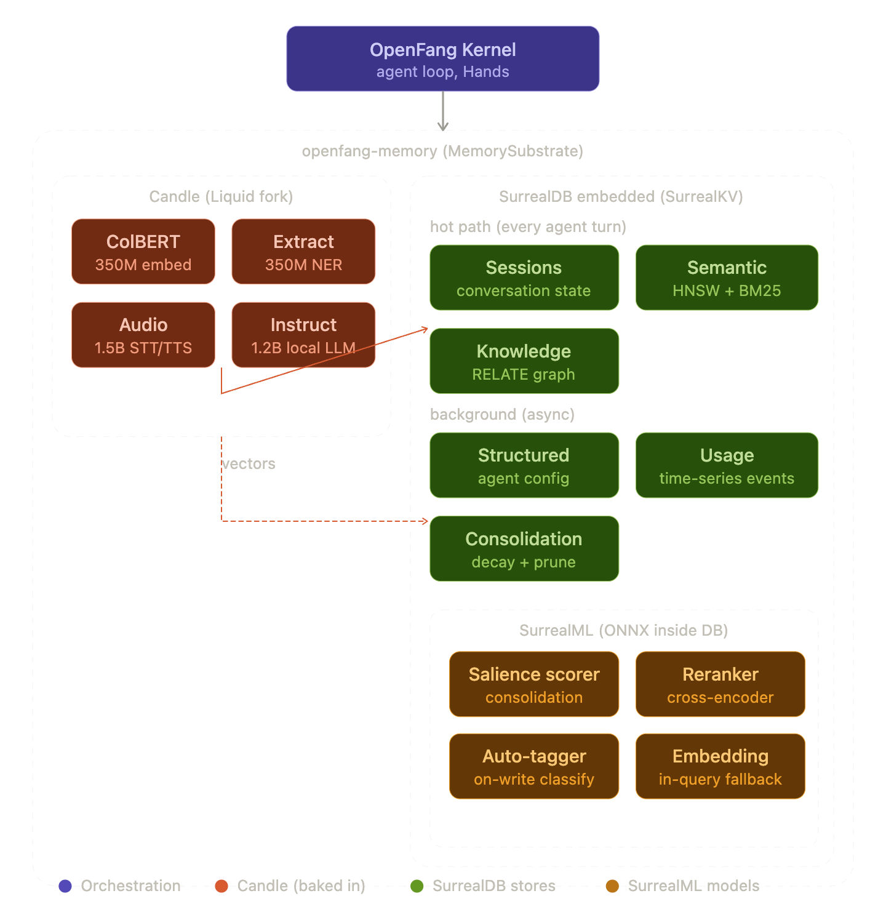
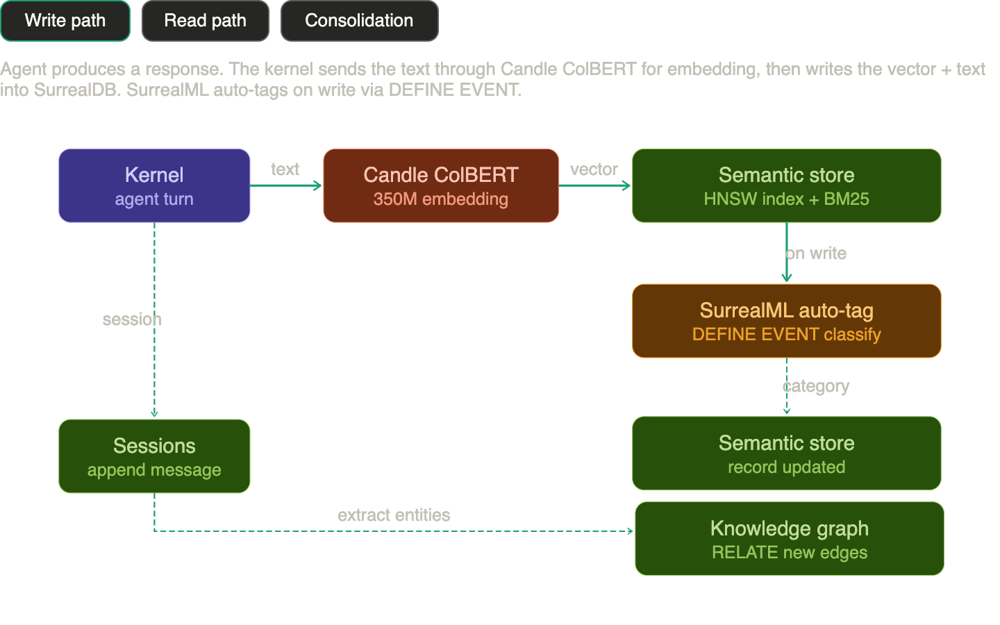
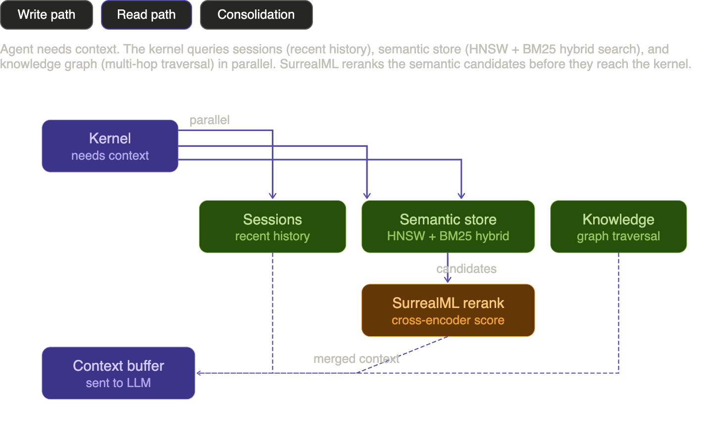
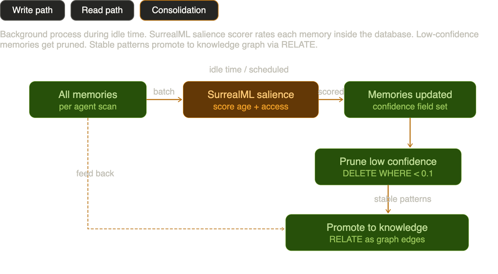

Liquid's model lineup isn't just "another LLM option." It's a complete set of tiny task-specific models that map almost perfectly onto your baked-in tier.

Look at what they have:

| Liquid Model | Size | Task | Replaces in your stack |
|---|---|---|---|
| **LFM2-ColBERT-350M** | 350M | Retrieval embeddings | MiniLM for semantic store |
| **LFM2-350M-Extract** | 350M | Structured JSON extraction | NER/classification |
| **LFM2-1.2B-RAG** | 1.2B | Context-grounded Q&A | Could handle retrieval-augmented reasoning locally |
| **LFM2.5-Audio-1.5B** | 1.5B | Audio — TTS, ASR, voice chat | Whisper + Kokoro |
| **LFM2-2.6B-Transcript** | 2.6B | Meeting summarization | Session compaction |
| **LFM2.5-1.2B-Instruct** | 1.2B | General chat + tool use | Small local LLM fallback |

Every single one is available in ONNX. And Liquid maintains their own Candle fork specifically for running these models — the `ios-compat` branch has Metal kernel modifications, which means it's already optimized for the M4 on Terminator.

This isn't "swap MiniLM for ColBERT." This is: **Liquid provides the entire baked-in inference tier as a coherent model family, all runnable through one framework (their Candle fork), all small enough to compile into or ship alongside the binary.**

The developer agent framed it as Option A (Burn + MiniLM) vs Option B (SurrealML). The actual option is Option C: Liquid's Candle fork as the unified inference backend for embeddings, extraction, audio, and small-model reasoning. Everything that doesn't need a big LLM runs through this one stack. The ONNX format means SurrealML can *also* load these models for in-query inference if needed — the two aren't mutually exclusive.

The question isn't which embedding model. It's whether you adopt Liquid's model family as the default inference layer for everything in the "bake in" tier.

Right — SurrealML's unique value isn't running models. It's running models *where the data already is, as part of the query*. That's a different thing from Candle handling the pipeline.

Think about what happens inside SurrealDB that shouldn't require a round-trip to the application layer:

**Consolidation scoring** — when `consolidate()` runs, it needs to decide which memories to decay, which to merge, which to promote. Right now that's a no-op. With SurrealML, you could have a small classifier inside the database that scores memory salience *as part of the consolidation query itself*. No extracting records, sending them to Candle, getting scores back, updating records. Just:

```sql
UPDATE memories SET confidence = ml::salience<0.1.0>({
    age_days: time::now() - created_at,
    access_count: access_count,
    last_accessed: last_accessed
}) WHERE agent_id = $agent;

DELETE FROM memories WHERE confidence < 0.1;
```

**Auto-tagging on write** — when a new memory is created, SurrealML could classify it inline without the kernel needing to orchestrate a separate inference call:

```sql
DEFINE EVENT tag_memory ON memories WHEN $event = "CREATE" THEN {
    UPDATE $after SET category = ml::classifier<0.1.0>({
        text: $after.content
    });
};
```

**Re-ranking at read time** — when the semantic store returns HNSW candidates, SurrealML could apply a cross-encoder reranker *inside the query* before results hit the kernel. ColBERT from Liquid exported to `.surml` would actually live in both worlds — Candle for the initial embedding, SurrealML for the reranking pass.

So the split is: **Candle handles the signal processing pipeline** (audio in, text out, embeddings generated). **SurrealML handles the data-native intelligence** (scoring, classifying, reranking things that are already in the database). They don't compete — they operate at different layers of the stack.

This needs two diagrams — one showing where everything lives structurally, and one showing how data actually flows through it. Let me start with the containment view.



That's where everything lives. Now here's how data actually moves through it — the three paths that matter: writing a memory, reading context, and background consolidation.





The structural diagram shows the two inference layers nested inside the memory substrate — Candle on the left handling the pipeline work (embedding, NER, audio, local LLM), SurrealDB on the right holding all six stores with SurrealML models living *inside* the database.

The dataflow diagram has three tabs:

**Write path** — text flows through Candle ColBERT for embedding, lands in the semantic store's HNSW index, then SurrealML auto-tags it via a `DEFINE EVENT` trigger. Entities get extracted and fed into the knowledge graph as `RELATE` edges. Sessions get the raw message appended.

**Read path** — the kernel queries all three hot-path stores in parallel. Sessions returns recent history, semantic store does hybrid HNSW + BM25, knowledge graph traverses relations. The semantic candidates pass through SurrealML's reranker (cross-encoder) before everything merges into the context buffer that gets sent to the external LLM.

**Consolidation** — runs during idle time. SurrealML's salience scorer rates every memory by age and access patterns *inside the database*. Low-confidence memories get pruned. Stable patterns promote to the knowledge graph as new edges. The whole loop stays inside SurrealDB — no round-trips to the application layer.